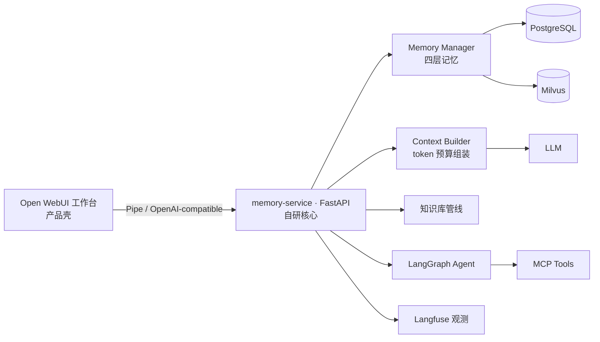

# AI 长会话知识工作台

> 面向求职与技术学习的多会话 Agent 系统：基于 Open WebUI 构建工作台形态，自研长期记忆与上下文组装服务，支持跨会话记忆、知识库问答、MCP 工具调用、token 成本控制和 Langfuse 观测。

**当前状态**：🚧 开发中（处于工程准备阶段）

---

## 解决什么问题

| 问题 | 解法 |
|---|---|
| 长对话上下文无限膨胀 | 四层记忆 + token 预算组装 + 滚动摘要 |
| 跨会话信息丢失 | 长期记忆抽取、存储、检索、注入 |
| 记忆不可控 | 记忆查看/编辑/删除、冲突检测、版本链、TTL |

## 系统架构（概览）

完整架构图与模块设计见 [docs/01-项目开发内容与实现方案.md](docs/01-项目开发内容与实现方案.md)。

## 模块来源声明（重要）

本项目为**二次开发 + 自研**结合，如实声明如下：

| 模块 | 来源 |
|---|---|
| 聊天 UI / 工作台形态 | [Open WebUI](https://github.com/open-webui/open-webui)（二开，保留其 license 与署名） |
| 会话与消息存储 | 自研 |
| 四层记忆模型（抽取/检索/冲突管线） | 自研 |
| 上下文组装与 token 预算 | 自研 |
| 滚动摘要 | 自研 |
| 知识库管线 | 自研 |
| MCP 工具接入与权限分级 | 自研 |
| Langfuse 观测接入 | 自研 |
| 评测集与脚本 | 自研 |

## 快速开始

> 开发中，部署方式将在 M1 里程碑完成后补充（Docker Compose 一键启动）。

## 文档索引

| 文档 | 内容 |
|---|---|
| [docs/01-项目开发内容与实现方案.md](docs/01-项目开发内容与实现方案.md) | 架构、数据模型、11 个核心模块设计、API、评测、开发计划 |
| [docs/02-开发规范.md](docs/02-开发规范.md) | 代码风格、注释、分支与提交、测试、安全规范 |
| [docs/03-GitHub仓库准备与上传指南.md](docs/03-GitHub仓库准备与上传指南.md) | 仓库初始化、安全检查、上传与分支保护 |

## License 说明

- 自研部分（`services/memory-service/` 等）：待定（个人项目，拟 MIT）
- Open WebUI 相关代码：遵循其上游 license 要求，保留署名与版权声明，不做删除或遮挡
