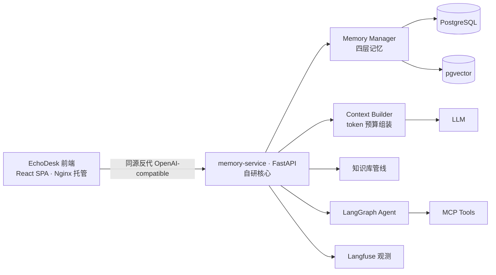

# AI 长会话知识工作台（EchoDesk）

> 面向求职与技术学习的多会话 Agent 系统：自研前端工作台（React + TypeScript + Tailwind）+ 自研长期记忆与上下文组装服务（memory-service），支持跨会话记忆、知识库问答、MCP 工具调用、token 成本控制和 Langfuse 观测。

**当前状态**：✅ 核心功能已交付（后端 M-01~M-13 全部收官 + 评测优化轮；前端阶段2 M-F1~M-F6 收官，自研前端为唯一产品入口）

---

## 解决什么问题

| 问题 | 解法 |
|---|---|
| 长对话上下文无限膨胀 | 四层记忆 + token 预算组装 + 滚动摘要 |
| 跨会话信息丢失 | 长期记忆抽取、存储、检索、注入 |
| 记忆不可控 | 记忆查看/编辑/删除、冲突检测、版本链、TTL |

## 系统架构（概览）



完整架构图与模块设计见 [docs/01-项目开发内容与实现方案.md](docs/01-项目开发内容与实现方案.md)。

## 模块来源声明（重要）

本项目以**自研为主**，如实声明如下：

| 模块 | 来源 |
|---|---|
| 前端工作台（聊天 UI / 记忆工作台 / 知识库 / 任务 / 用量 / 设置） | 自研（React 18 + TypeScript + Vite + Tailwind） |
| 会话与消息存储 | 自研 |
| 四层记忆模型（抽取/检索/冲突管线） | 自研 |
| 上下文组装与 token 预算 | 自研 |
| 滚动摘要 | 自研 |
| 知识库管线 | 自研 |
| MCP 工具接入与权限分级 | 自研 |
| Langfuse 观测接入 | 自研 |
| 评测集与脚本 | 自研 |

> 历史说明：早期（阶段1）曾采用 [Open WebUI](https://github.com/open-webui/open-webui) 官方镜像（未修改其源码）+ 自研 Pipe 桥接函数作为产品壳验证链路；阶段2 起替换为上述自研前端，Open WebUI 容器与 Pipe 已退役（Pipe 脚本归档于 `deploy/pipes/` 供追溯）。仓库不含 Open WebUI 源码，无二开代码，不涉及其 license 义务。

## 快速开始

依赖：Docker Desktop（含 WSL2 后端）。

```powershell
# 1. 配置环境变量：复制模板并填写数据库密码 / LLM key 等
cp deploy/.env.example deploy/.env

# 2. 一键启动（首次会构建镜像）
docker compose -f deploy/docker-compose.yml --profile observability up -d --build

# 3. 执行数据库迁移
docker exec workbench-memory alembic upgrade head

# 4. 浏览器访问 http://localhost:3000，注册账号即用
```

端口约定：前端 web 3000 / memory-service 8100 / PostgreSQL 5432 / Redis 6379 / embedding 7997 / Langfuse 3001。详细说明见 [docs/04-本地环境运行手册.md](docs/04-本地环境运行手册.md)。

## 文档索引

| 文档 | 内容 |
|---|---|
| [docs/01-项目开发内容与实现方案.md](docs/01-项目开发内容与实现方案.md) | 架构、数据模型、11 个核心模块设计、API、评测、开发计划 |
| [docs/02-开发规范.md](docs/02-开发规范.md) | 代码风格、注释、分支与提交、测试、安全规范 |
| [docs/03-GitHub仓库准备与上传指南.md](docs/03-GitHub仓库准备与上传指南.md) | 仓库初始化、安全检查、上传与分支保护 |
| [docs/04-本地环境运行手册.md](docs/04-本地环境运行手册.md) | Docker Compose 环境启停、日志、数据管理、FAQ |
| [docs/05-品牌定制与界面修改方案.md](docs/05-品牌定制与界面修改方案.md) | 历史存档：阶段1 Open WebUI 壳的品牌定制与 License 合规分析（阶段2 起前端自研，本文档仅供追溯） |
| [docs/06-模块开发规格书.md](docs/06-模块开发规格书.md) | M-01~M-13 模块实现级规格：文件清单、接口签名、测试用例、验收标准 |

## License 说明

- 全部代码（`frontend/`、`services/memory-service/`、`deploy/` 等）均为自研：个人项目，以 [MIT](LICENSE) 发布
- Open WebUI：仓库不含其源码、无二开代码（阶段1 仅官方镜像运行 + 自研 Pipe 脚本桥接），不涉及上游 license 义务；Pipe 脚本为自研代码
