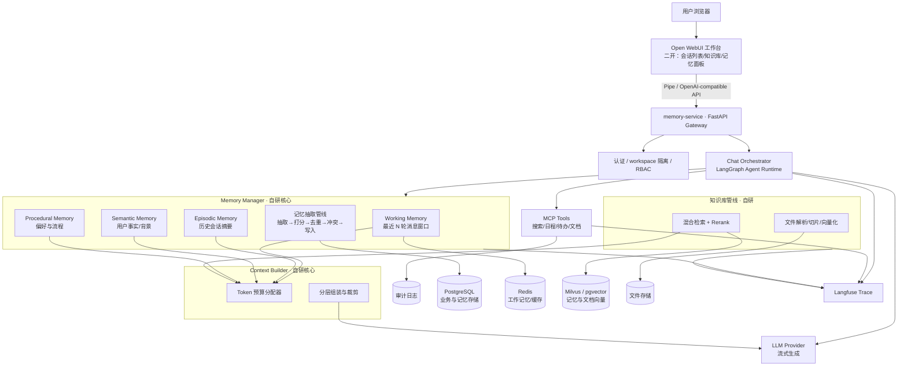
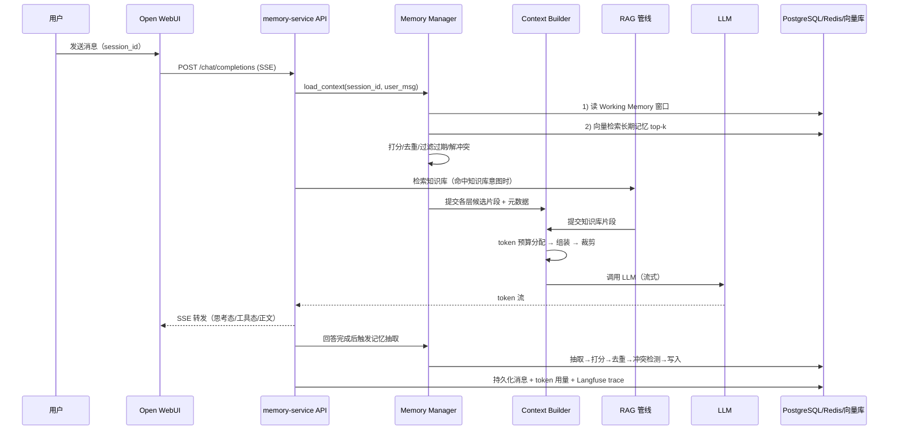

# AI 长会话知识工作台 — 项目开发内容与实现方案

> 项目全称：AI 长会话知识工作台：面向求职与技术学习的多会话 Agent 系统
>
> 一句话定位：基于 Open WebUI 构建工作台形态，自研长期记忆与上下文组装服务，支持跨会话记忆、知识库问答、MCP 工具调用、token 成本控制和 Langfuse 观测。
>
> 上游来源声明：前端工作台基于 [Open WebUI](https://github.com/open-webui/open-webui) 二次开发，保留上游署名与许可要求；记忆服务、上下文工程、评测体系为自研模块。
>
> 文档版本：v1.0（2026-09-18）

---

## 目录

1. [项目概述](#1-项目概述)
2. [系统总体架构](#2-系统总体架构)
3. [技术栈清单](#3-技术栈清单)
4. [数据模型设计](#4-数据模型设计)
5. [核心模块详细设计（需实现部分）](#5-核心模块详细设计需实现部分)
6. [API 设计](#6-api-设计)
7. [功能清单与优先级](#7-功能清单与优先级)
8. [评测方案](#8-评测方案)
9. [代码仓库结构](#9-代码仓库结构)
10. [开发计划](#10-开发计划)
11. [合规与署名规范](#11-合规与署名规范)
12. [简历与面试准备要点](#12-简历与面试准备要点)

---

## 1. 项目概述

### 1.1 解决什么问题

现有 AI 对话产品普遍存在三个工程问题，本项目逐一解决：

| 问题 | 表现 | 本项目的解法 |
|---|---|---|
| 上下文无限膨胀 | 长对话 token 成本线性增长，最终超出窗口 | 分层记忆 + token 预算组装 + 滚动摘要 |
| 跨会话信息丢失 | 新会话忘记用户说过的事实、偏好、任务进度 | 长期记忆抽取、存储、检索、注入 |
| 记忆不可控 | 记忆错误无法发现，过时无法更新，用户不可见 | 记忆查看/编辑/删除、冲突检测、版本管理、TTL |

### 1.2 目标场景

**主场景：求职工作台**（开发者本人即真实用户，便于积累真实数据）：

- 上传简历、JD、公司资料、面经作为知识库
- 跨天跟踪投递状态、面试进度、复习计划（Task Continuity）
- 长期记住用户的技术背景、目标岗位、薄弱项（Semantic / Procedural Memory）
- 例："我上周说过的那家公司在几面了？" → 跨会话记忆检索命中

**可迁移场景**（证明项目通用性）：技术学习工作台、企业内部知识助手、个人助理。

### 1.3 项目能力目标（对应简历缺口）

| 能力目标 | 验收标准 |
|---|---|
| 长对话 | 50 轮以上对话不超窗口、不失控，token 成本可控 |
| 长期记忆 | 跨会话正确回忆用户事实/偏好/任务状态，Memory Recall@5 ≥ 80% |
| 会话状态管理 | 会话可恢复、可删除，消息有版本，并发会话互相隔离 |
| 上下文工程 | 分层记忆 + RAG + 工具结果按预算统一组装，策略可 A/B |
| 多用户与权限 | workspace 级数据隔离，用户只能访问自己的数据 |
| 异步与流式 | SSE 流式输出，长任务不阻塞 |
| 观测 | Langfuse 全链路 trace：模型调用、记忆检索、工具执行、token、延迟 |
| 评测 | 50+ 轮长对话评测集，9 项指标可自动产出报告 |

---

## 2. 系统总体架构

### 2.1 服务拆分原则

**Open WebUI 只做产品壳（前端 + 聊天交互），所有 Agent 能力收敛到自研的 memory-service（Python / FastAPI）。** 两者通过 Open WebUI 的 Pipe/Function 机制对接：Open WebUI 收到用户消息后，调用 memory-service 暴露的 OpenAI-compatible 接口完成记忆检索、上下文组装、RAG、工具调用与生成。

好处：

1. 自研代码与上游代码解耦，上游升级不冲突；
2. 简历可如实表述"基于 Open WebUI 构建工作台形态，自研记忆服务与上下文组装模块"；
3. memory-service 可独立部署、独立测试、独立讲原理。

### 2.2 架构图



### 2.3 请求处理主链路（时序）



---

## 3. 技术栈清单

| 层 | 选型 | 用途说明 |
|---|---|---|
| 前端工作台 | Open WebUI（二开） | 聊天 UI、会话列表、文件上传、用户体系；通过 Pipe 机制对接自研服务 |
| 后端框架 | Python 3.11+ / FastAPI | memory-service：REST + SSE、Pydantic 校验 |
| Agent 编排 | LangGraph | 对话状态图、checkpoint、工具循环、防死循环 |
| LLM 接入 | OpenAI-compatible SDK | 主模型可替换；抽取/摘要可配置为便宜的小模型 |
| Embedding | BGE-M3 | 记忆向量 + 文档向量统一 |
| 向量库 | Milvus（或 pgvector 起步） | 记忆检索、知识库检索 |
| 业务库 | PostgreSQL + SQLAlchemy + Alembic | 会话/消息/记忆/审计/用量等结构化数据 |
| 缓存 | Redis | Working Memory、摘要缓存、分布式锁 |
| 工具协议 | MCP（Model Context Protocol） | 外部工具：搜索、日程、待办、文档 |
| 观测 | Langfuse（self-host） | trace、token、延迟、失败率、评测数据源 |
| 任务队列 | Celery / ARQ + Redis | 文件向量化、批量记忆抽取等异步任务 |
| 部署 | Docker Compose | 一键起 Open WebUI + memory-service + PG + Redis + Milvus + Langfuse |
| 测试 | pytest + httpx | 单元 / 集成 / 评测脚本 |

---

## 4. 数据模型设计

> 所有业务表带 `workspace_id` 外键，是数据隔离的第一道防线；服务层再做权限校验，两道防线缺一不可。

### 4.1 表结构总览

| 表 | 职责 | 关键字段 |
|---|---|---|
| `workspaces` | 工作区（隔离边界） | id, name, owner_id, settings(jsonb), created_at |
| `users` | 用户 | id, username, password_hash, role(admin/member), created_at |
| `workspace_members` | 用户-工作区多对多 | workspace_id, user_id, role |
| `sessions` | 会话 | id, workspace_id, user_id, title, status(active/archived), rolling_summary, token_total, last_message_at, created_at |
| `messages` | 消息 | id, session_id, role(user/assistant/tool), content, token_count, version, metadata(jsonb：工具调用、引用、trace_id), created_at |
| `memories` | 长期记忆（统一表） | 见 4.2 |
| `memory_events` | 记忆事件流水 | id, memory_id, event_type(create/update/merge/conflict/hit/expire/edit_by_user), old_value, new_value, source, created_at |
| `knowledge_files` | 知识库文件 | id, workspace_id, filename, file_type, checksum, status(parsing/embedded/failed), version, uploaded_by, created_at |
| `knowledge_chunks` | 文档切片 | id, file_id, chunk_index, content, token_count, metadata(jsonb)（向量存向量库，以 chunk_id 关联） |
| `tasks` | 任务/待办 | id, workspace_id, title, status(open/doing/done/abandoned), due_date, related_session_ids(jsonb), updated_at |
| `tool_call_logs` | 工具审计 | id, session_id, tool_name, risk_level, args, result_digest, status, approver, created_at |
| `token_usages` | 用量统计 | id, session_id, turn_no, prompt_tokens, completion_tokens, memory_tokens, rag_tokens, tool_tokens, cost_usd, created_at |
| `checkpoints` | LangGraph 快照 | id, session_id, state(jsonb), created_at（任务恢复用） |

### 4.2 `memories` 统一记忆表（核心）

用 `memory_type` 区分四层，避免一类型一张表导致检索逻辑分裂：

| 字段 | 类型 | 说明 |
|---|---|---|
| id | UUID | 主键 |
| workspace_id / user_id | UUID | 归属，隔离用 |
| memory_type | enum | `episodic` / `semantic` / `procedural`（working 在 Redis，knowledge 在向量库，均不落此表） |
| key | varchar | 结构化主题键，如 `skill.langgraph`、`job.公司A.progress`，冲突检测用 |
| content | text | 记忆正文 |
| content_vector | vector | content 的 embedding（存向量库，表内只存引用） |
| confidence | float | 抽取置信度（LLM 自评 0~1） |
| importance | float | 重要性评分 |
| status | enum | `active` / `superseded` / `conflicted` / `archived` / `deleted` |
| source_session_id | UUID | 来源会话 |
| source_message_ids | jsonb | 来源消息，支撑"记忆可溯源" |
| supersedes_id | UUID | 指向被替代的旧版本，形成版本链 |
| version | int | 版本号 |
| expires_at | timestamptz | TTL，如"投递进度"类短期事实 |
| hit_count / last_hit_at | int / timestamptz | 被检索命中统计（反哺 importance） |
| created_at / updated_at | timestamptz | 时间戳 |

---

## 5. 核心模块详细设计（需实现部分）

> 本章即项目的"开发内容清单"，每个模块给出职责、输入输出、关键实现点。

### 5.1 多会话管理模块

**职责**：会话生命周期管理、消息持久化、会话恢复、并发隔离。

**实现要点**：

1. 会话 CRUD：创建时生成默认标题（首条消息 LLM 摘要命名），支持重命名、归档、删除（软删除 + 关联记忆可选保留）。
2. 消息持久化：每条消息带 `token_count` 与 `metadata`（引用的知识片段、工具调用、Langfuse trace_id），回答可追溯。
3. 会话恢复：进入会话时从 DB 加载消息 + `sessions.rolling_summary` 重建上下文；LangGraph checkpoint 支持中断任务续跑。
4. 并发隔离：同一会话并发写入用 Redis 分布式锁（session 级），不同会话天然隔离；消息 `version` 字段做乐观锁。
5. **接口**：`SessionService`（create / list / get / rename / archive / delete / restore）。

### 5.2 Memory Manager（自研核心 ①：四层记忆）

**职责**：记忆的读（检索）与写（抽取入库），是本项目技术含量最高的模块。

#### 5.2.1 四层记忆的存储与读取

| 层 | 存放 | 写入时机 | 读取方式 |
|---|---|---|---|
| Working Memory | Redis（session 级 list，TTL 7 天） | 每轮追加 | 直接取最近 N 轮（按 token 上限裁剪） |
| Episodic Memory | PG + 向量库（会话摘要即 `sessions.rolling_summary` 完成后归档生成） | 会话结束/摘要更新时 | 当前会话用滚动摘要；跨会话历史按 query 向量检索 |
| Semantic Memory | PG + 向量库 | 每轮回答后异步抽取 | query 向量检索 top-k + key 精确匹配 |
| Procedural Memory | PG | 抽取（偏好类） | 全量注入（量小、优先级最高） |
| Knowledge Memory | 向量库（knowledge_chunks） | 文件上传管线 | RAG 检索（5.5） |

#### 5.2.2 记忆抽取管线（写路径）

```
对话轮次（user + assistant 消息）
  → ① LLM 结构化抽取（JSON schema：fact / preference / task_state / event，含 key、confidence）
  → ② 打分（confidence × importance × recency 衰减）
  → ③ 去重（同 key 或向量相似度 > 0.92 → 判定重复）
       ├─ 语义一致 → 合并并提升 confidence
       └─ 语义不一致 → 冲突处理
  → ④ 冲突处理（LLM 仲裁：新事实覆盖旧事实 → 旧记忆 status=superseded 并挂版本链；
       无法判定 → 双条标 conflicted，等待用户在记忆面板裁决）
  → ⑤ 写入（UPSERT + memory_events 流水）
```

**实现要点**：

- 抽取用便宜的小模型异步执行（Celery），不阻塞回答流；
- 抽取 prompt 需区分"临时讨论内容"与"值得长期记住的内容"，控制噪声；
- TTL：任务进度类事实默认 30 天过期，`expires_at` 到期后检索自动过滤（软过期，不物理删除）；
- 每次记忆被注入上下文时更新 `hit_count`，作为评测和 importance 校准数据。

#### 5.2.3 记忆检索（读路径）

```
query（当前用户消息）
  → 向量检索（semantic + episodic 合并候选，top-k=20）
  → 过滤（workspace/user 归属、status=active、未过期）
  → 重排（向量相似度 + importance + recency + hit_count 加权）
  → 去重（同 key 只保留最高分）
  → 返回 top-k（默认 8）带来源元数据
```

### 5.3 Context Builder（自研核心 ②：上下文组装）

**职责**：把所有候选片段在 token 预算内组装成最终 prompt，是"上下文工程"的落点。

#### 5.3.1 预算分配（默认策略，总预算 = 模型窗口 − 输出预留）

| 上下文区块 | 预算占比（默认） | 优先级 | 淘汰策略 |
|---|---|---|---|
| System prompt（角色+规则+记忆使用说明） | 固定 ≈ 5% | — | 不裁剪 |
| Procedural Memory（偏好） | 5% | 1（最高） | 超预算按 importance 截断 |
| Semantic Memory（事实） | 15% | 2 | 低分淘汰 |
| Episodic Memory（跨会话摘要） | 10% | 3 | 低分淘汰 |
| Working Memory（最近消息原文） | 30% | 4（保底） | 从最旧开始滑窗 |
| RAG 知识片段 | 25% | 5 | 低相关淘汰 |
| 当前轮工具结果 | 10% | 6（当轮必须） | 结果摘要化 |
| 缓冲 | 剩余 | — | 吸收波动 |

**实现要点**：

1. 预算表可配置（YAML），支持 A/B 两套策略（如"记忆优先"vs"知识优先"）对比评测；
2. 装配顺序固定：system → 偏好 → 事实 → 历史摘要 → 近期消息 → 知识 → 工具结果 → 当前问题；
3. 每区块注入结构化标记（如 `<memory type="semantic" source="...">`），LLM 引用可溯源；
4. 提供调试端点 `POST /api/context/preview`：返回某轮的完整组装结果与各区块 token 占用，便于演示和排查。

### 5.4 长对话处理管线（滚动摘要）

**职责**：防止单会话上下文膨胀。

**实现要点**：

1. 触发条件：Working Memory 累计 token 超过阈值（默认 4k）；
2. 滚动方式：将滑出的旧消息段增量摘要进 `sessions.rolling_summary`（摘要也带缓存，只对新增段调一次摘要模型）；
3. 二级压缩：摘要本身超过阈值时做"摘要的摘要"，保留任务/决策类信息，丢弃寒暄细节；
4. 摘要完成后写入 Episodic Memory，供未来其他会话检索。

### 5.5 知识库模块（RAG 管线）

**职责**：文件上传 → 解析 → 切片 → 向量化 → 检索 → 问答。

**实现要点**（复用你现有 RAG 经验，但为工作台形态重做工程化）：

1. 上传：多文件（pdf/md/docx/txt），checksum 去重，Celery 异步处理，SSE/轮询回报进度；
2. 解析切片：复用 MinerU 思路；语义切片 + token 上限（默认 512）+ 10% overlap；
3. 向量化：BGE-M3，写入 Milvus collection（按 workspace 隔离 partition）；
4. 检索：向量 + BM25 混合 → RRF 融合 → Reranker 精排，top-k 进 Context Builder 的 RAG 区块；
5. 文件版本：同名重传生成新版本，旧版本向量下线不删除；
6. 引用回传：回答的 `metadata.citations` 记录 chunk 出处，前端展示来源。

### 5.6 MCP 工具调用模块

**职责**：让 Agent 能执行外部动作（待办增删、日程、搜索、文档读取）。

**实现要点**：

1. MCP client 接入工具服务，工具注册表带 `risk_level`（read_only / write / external）；
2. 权限分级：read_only 自动执行；write 级默认自动但全量审计；external（发邮件、提交外部表单）需用户确认（SSE 推确认事件）；
3. LangGraph 工具循环：最大迭代 8 次防死循环，工具异常降级为"告知用户"而非崩溃；
4. 审计：`tool_call_logs` 记录全量参数与结果摘要；
5. 首批工具：任务待办（对接 5.7 的 tasks 表）、网页搜索、本地文档读取——求职场景闭环（"帮我把这家公司的面试准备加到待办"）。

### 5.7 任务与待办模块

**职责**：支撑 Task Continuity（跨会话任务继续）。

**实现要点**：

1. `tasks` 表由 Agent 通过 MCP 待办工具读写，也开放 REST API 给前端展示；
2. 任务状态变更同步抽取为 Semantic Memory（`job.xxx.progress`），双向一致；
3. 新会话开场检索高优先级未完成任务注入上下文，实现"接着上次继续"。

### 5.8 认证、多用户与 workspace 隔离

**职责**：RBAC 与数据隔离。

**实现要点**：

1. 认证：JWT（access + refresh）；Open WebUI 侧用户体系与 memory-service 用户做映射（ Pipe 调用时透传用户标识）；
2. RBAC：workspace 内 owner / admin / member 三角色；记忆管理、知识库管理限 admin 以上；
3. 隔离三道防线：所有查询强制 `workspace_id` 过滤（repository 层统一注入）→ 服务层权限校验 → 向量库按 workspace partition 物理隔离；
4. 编写隔离测试：用户 A 无法读写用户 B 的会话/记忆/知识库（测试用例固化，防回归）。

### 5.9 记忆管理 API 与面板

**职责**：记忆可查看、可编辑、可删除（用户可控是差异化亮点）。

**实现要点**：

1. REST：记忆列表（按类型/关键词过滤）、详情（含版本链与来源消息跳转）、编辑（写 `memory_events` 记 `edit_by_user`）、删除（软删除）；冲突记忆裁决端点；
2. 前端：Open WebUI 二开增加 "Memory" 面板页（列表 + 冲突标记 + 编辑弹窗）；若二开成本高，先用独立轻量 React 页面挂到工作台导航，API 不变；
3. 面板同时展示 token 用量统计（读 `token_usages` 聚合）。

### 5.10 观测模块（Langfuse）

**职责**：全链路 trace 与成本可视化。

**实现要点**：

1. 埋点范围（统一 trace_id 贯穿）：`chat.turn`（根）→ `memory.retrieve` / `memory.extract` / `context.assemble`（含各区 token）→ `rag.retrieve` → `llm.call`（流式 token/延迟）→ `tool.invoke`；
2. 关键业务指标从 Langfuse 导出聚合：Token Cost / Turn、P95 Latency、记忆命中率、工具失败率；
3. 评测集数据从 trace 拉取，避免手工记录。

### 5.11 评测模块

**职责**：用数据证明记忆与上下文工程有效。详见第 8 章。

---

## 6. API 设计

### 6.1 Chat（OpenAI-compatible，供 Open WebUI Pipe 调用）

| Method | Path | 说明 |
|---|---|---|
| POST | `/v1/chat/completions` | SSE 流式；兼容 OpenAI 格式，`metadata` 透传 workspace_id/session_id/用户标识 |

### 6.2 会话与消息

| Method | Path | 说明 |
|---|---|---|
| GET | `/api/sessions` | 当前 workspace 会话列表（分页、关键词） |
| POST | `/api/sessions` | 创建会话 |
| GET | `/api/sessions/{id}` | 会话详情（含摘要、token 统计） |
| PATCH | `/api/sessions/{id}` | 重命名 / 归档 |
| DELETE | `/api/sessions/{id}` | 删除（可选级联清理记忆） |
| GET | `/api/sessions/{id}/messages` | 消息历史（含引用与 trace 链接） |

### 6.3 记忆管理

| Method | Path | 说明 |
|---|---|---|
| GET | `/api/memories` | 列表（type / status / 关键词过滤，分页） |
| GET | `/api/memories/{id}` | 详情（版本链 + 来源消息） |
| PATCH | `/api/memories/{id}` | 用户编辑 |
| DELETE | `/api/memories/{id}` | 软删除 |
| POST | `/api/memories/{id}/resolve` | 冲突裁决（选择保留版本） |
| POST | `/api/memories/search` | 调试用：检索测试 |

### 6.4 知识库

| Method | Path | 说明 |
|---|---|---|
| POST | `/api/knowledge/files` | 上传（multipart，异步处理） |
| GET | `/api/knowledge/files` | 文件列表与处理状态 |
| DELETE | `/api/knowledge/files/{id}` | 删除（向量同步下线） |
| POST | `/api/knowledge/query` | 检索调试（返回 chunks + 分数） |

### 6.5 任务、审计与观测

| Method | Path | 说明 |
|---|---|---|
| GET/POST/PATCH | `/api/tasks` | 任务清单 CRUD（Agent 与前端共用） |
| GET | `/api/audit/tool-calls` | 工具审计查询 |
| GET | `/api/usage/summary` | token 用量聚合（按 workspace/会话/时间） |
| POST | `/api/context/preview` | 上下文组装预览（调试/演示） |
| GET | `/healthz` `/readyz` | 健康检查 |

> 所有 `/api/*` 端点要求 JWT，且按 workspace 鉴权；错误统一 RFC 7807 problem+json 结构。

---

## 7. 功能清单与优先级

### P0 — 必须完成（Demo 与简历的底线）

- [ ] Docker Compose 一键部署（Open WebUI + memory-service + PG + Redis + Milvus + Langfuse）
- [ ] Open WebUI Pipe 打通自研服务（OpenAI-compatible SSE）
- [ ] 多会话创建 / 列表 / 恢复 / 删除，消息持久化
- [ ] Working Memory 窗口（最近 N 轮 + token 裁剪）
- [ ] 滚动摘要（超阈值自动压缩）
- [ ] 事实抽取入长期记忆（Semantic / Procedural）
- [ ] 记忆检索注入 prompt（向量 + 重排）
- [ ] workspace 数据隔离 + JWT 认证
- [ ] SSE 流式输出
- [ ] 记忆查看 / 删除 API（+ 基础面板）
- [ ] Langfuse trace 覆盖主链路

### P1 — 增强竞争力（拉开与普通 ChatUI 的差距）

- [ ] 记忆冲突检测与版本链（superseded / conflicted 状态机）
- [ ] 记忆置信度与来源消息溯源
- [ ] 记忆 TTL 与过期过滤
- [ ] 用户编辑记忆（memory_events 审计）
- [ ] token 成本统计面板（分区块用量可视化）
- [ ] MCP 工具调用（待办 + 搜索，权限分级 + 审计）
- [ ] 知识库文件问答（上传→切片→向量化→引用回答）
- [ ] 任务清单与跨会话 Task Continuity
- [ ] 上下文组装策略 A/B（两套预算配置可切换）
- [ ] 评测集与自动化评测脚本（50+ 轮长对话）

### P2 — 时间富余再做

- [ ] 记忆重要性的 hit_count 在线学习校准
- [ ] 多模型路由（抽取/摘要用小模型降成本）
- [ ] 会话导出（Markdown/JSON）
- [ ] 前端记忆冲突裁决交互优化
- [ ] Open WebUI 上游版本升级同步流程

---

## 8. 评测方案

### 8.1 评测集构建

1. **长对话集**：10 组 × 50+ 轮真实/半真实对话（求职场景：自我介绍 → 项目深挖 → 薄弱项确认 → 跨天复习 → 追问旧事实）；
2. **记忆命中集**：100 条"应被记住的事实"配对提问（录入事实 → 隔 N 轮 / 新会话提问 → 判定是否正确引用）；
3. **冲突集**：30 组新旧事实矛盾对话（换手机号、目标岗位变更），验证冲突处理；
4. **任务连续性集**：20 个跨会话任务（会话 A 创建目标，会话 B 要求继续）。

数据格式：JSONL（对话脚本 + 期望记忆点 + 判定问题 + 期望答案要点 + LLM-as-judge rubric）。

### 8.2 指标与计算方式

| 指标 | 计算方式 | 目标 |
|---|---|---|
| Memory Recall@5 | 期望记忆出现在注入上下文 top-5 的比例 | ≥ 80% |
| Memory Precision | 注入记忆中有效记忆占比 | ≥ 70% |
| Context Precision | 注入上下文对回答有贡献比例（LLM-as-judge） | ≥ 70% |
| Long-turn Consistency | 50 轮后仍遵守用户偏好（规则断言 + 抽查） | ≥ 90% |
| Fact Conflict Rate | 冲突场景中新旧事实并存于上下文比例 | ≤ 10% |
| Hallucination Rate | 无依据关键论断比例（LLM-as-judge 抽查） | ≤ 5% |
| Token Cost / Turn | token_usages 聚合平均 | 对比基线（全量历史塞入）下降 ≥ 40% |
| P95 Latency | Langfuse trace 首 token / 端到端 | 首 token ≤ 2s，端到端 P95 ≤ 8s |
| Task Continuity | 跨会话任务成功继续比例 | ≥ 80% |

### 8.3 评测执行

- `evals/run_eval.py`：回放评测集 → 调用 API → 采集注入上下文与回答 → 计算指标 → 输出 Markdown 报告；
- A/B：同一评测集跑两套上下文策略，报告对比表；
- 数字待真实测试后填写进简历，不提前编造。

---

## 9. 代码仓库结构

```
ai-long-workbench/
├── open-webui/                    # Open WebUI（fork，保留上游 license 与署名）
│   └── src/lib/functions/         # 二开：Pipe 对接 memory-service
├── services/
│   └── memory-service/            # ★ 自研核心服务
│       ├── app/
│       │   ├── main.py            # FastAPI 入口
│       │   ├── core/              # 配置、JWT、依赖注入、日志
│       │   ├── api/               # 路由：chat / sessions / memories / knowledge / tasks / usage
│       │   ├── models/            # SQLAlchemy ORM（第 4 章表结构）
│       │   ├── schemas/           # Pydantic 请求/响应模型
│       │   ├── memory/            # ★ Memory Manager：四层记忆 + 抽取/检索/冲突管线
│       │   ├── context/           # ★ Context Builder：预算分配与组装
│       │   ├── summarizer/        # 滚动摘要
│       │   ├── rag/               # 知识库：解析/切片/向量化/混合检索
│       │   ├── agent/             # LangGraph 对话图 + 工具循环 + checkpoint
│       │   ├── tools/             # MCP client、工具注册表、权限分级
│       │   └── observability/     # Langfuse 埋点
│       ├── alembic/               # 数据库迁移
│       ├── workers/               # Celery 异步任务（抽取/向量化）
│       ├── evals/                 # ★ 评测集 + 评测脚本 + 报告
│       ├── tests/                 # 单元 / 集成 / 隔离测试
│       └── config/                # 预算策略 YAML（支持 A/B 两套）
├── deploy/
│   ├── docker-compose.yml         # 全栈编排
│   └── .env.example
└── docs/                          # 架构、API、使用手册、评测报告
```

---

## 10. 开发计划

> 按 14 天冲刺组织，分为三个里程碑；每天产出可验证，避免"最后一天才联调"。

### M1 基础骨架（Day 1–3）

| 天 | 任务 | 验收 |
|---|---|---|
| Day 1 | Docker Compose 起 Open WebUI + PG + Redis；阅读 Open WebUI Pipe 机制 | 浏览器可用工作台，能配自定义模型端点 |
| Day 2 | memory-service 骨架：FastAPI + SQLAlchemy + Alembic 建表（第 4 章） | `/healthz` 通，表结构落库 |
| Day 3 | OpenAI-compatible `/v1/chat/completions`（直连 LLM，SSE）+ Pipe 打通 | 在 Open WebUI 里聊天，消息落库 |

### M2 记忆与上下文核心（Day 4–8）

| 天 | 任务 | 验收 |
|---|---|---|
| Day 4 | 多会话管理 + Working Memory 窗口（token 裁剪） | 会话列表/恢复可用；长消息不超窗口 |
| Day 5 | 滚动摘要（增量摘要 + 二级压缩） | 100 轮会话 token 占用平稳 |
| Day 6 | 记忆抽取管线（结构化抽取 → 打分 → 去重 → 入库） | 对话后 memories 表出现结构化事实 |
| Day 7 | 记忆检索（向量 + 重排 + 过滤）注入 prompt | 新会话能答对旧会话事实 |
| Day 8 | Context Builder（预算分配 + 组装 + 裁剪 + preview 端点） | preview 可视化各区块 token 占用 |

### M3 产品化与验证（Day 9–14）

| 天 | 任务 | 验收 |
|---|---|---|
| Day 9 | 记忆管理 API + 面板（查看/编辑/删除） | 用户可管理自己的记忆 |
| Day 10 | 知识库（上传→切片→向量化→检索→引用回答） | 上传简历可问答且带引用 |
| Day 11 | MCP 工具（待办 + 搜索，权限分级 + 审计）+ 任务连续性 | "加到待办"→ 新会话可继续任务 |
| Day 12 | Langfuse 全链路埋点 + token 用量统计 | trace 树完整，成本可查 |
| Day 13 | 评测集 + 自动化评测脚本，跑首轮报告 | 指标报告产出 |
| Day 14 | README（含模块来源表、架构图）、Demo 录屏、简历描述 | 可投递状态 |

> 冲突检测、TTL、A/B 策略（P1）若 14 天内未完成，作为二期继续，不影响项目成立。

---

## 11. 合规与署名规范

1. **上游声明**：README 首屏注明"前端工作台基于 Open WebUI 二次开发"，保留其 license 文件、版权声明与界面署名（如 "Powered by Open WebUI"），不删除、不遮挡；
2. **License 审查**：动手前复核 Open WebUI 当前 license 条款（其品牌/附加条款可能随版本变化），确认二开与展示方式合规；
3. **自研边界诚实**：简历与面试中明确"二开 + 自研模块"结构，模块来源表如下，绝不包装成纯自研；
4. **数据合规**：求职数据仅本人使用；Demo 录屏脱敏。

### 模块来源表（README 必含）

| 模块 | 来源 |
|---|---|
| 聊天 UI / 工作台形态 | Open WebUI（二开） |
| 会话与消息存储 | 自研 |
| 四层记忆模型与抽取/检索/冲突管线 | 自研 |
| 上下文组装与 token 预算 | 自研 |
| 滚动摘要 | 自研 |
| 知识库管线 | 自研（复用既有 RAG 经验） |
| MCP 工具接入与权限分级 | 自研 |
| Langfuse 观测接入 | 自研 |
| 评测集与脚本 | 自研 |

---

## 12. 简历与面试准备要点

### 12.1 简历描述（结构模板，数字待真实测试填写）

**AI 长会话知识工作台（个人项目，基于 Open WebUI 二次开发）**

- 项目描述：面向求职复习与技术学习场景，构建支持多会话、长期记忆、知识库问答和 MCP 工具调用的 AI 工作台；自研记忆管理与上下文组装模块，解决长对话上下文膨胀、跨会话信息丢失、无关记忆污染回答等问题。
- 技术栈：Python、FastAPI、LangGraph、Open WebUI、Milvus、PostgreSQL、Redis、MCP、Langfuse、Docker
- 核心工作：四层记忆模型 / 长对话上下文管线 / 记忆抽取与冲突处理 / workspace 隔离 / MCP + Langfuse / 50 轮长对话评测（详见第 5 章各模块，此处按简历版收敛为 6 条）
- 项目成果：Memory Recall@5 XX% / token 成本下降 XX% / Task Continuity XX% / P95 XX s

### 12.2 面试必答题准备

1. **"是不是开源包装？"** → 标准话术：前端壳来自 Open WebUI（README 保留署名），核心工作在独立的 memory-service：四层记忆、抽取冲突管线、token 预算组装、隔离与观测。
2. **"记忆冲突怎么处理？"** → key/向量定位 → LLM 仲裁 → superseded 版本链 / conflicted 等待用户裁决（结合 memory_events 举例）。
3. **"token 预算怎么分配？"** → 讲 5.3.1 的分区预算表 + 优先级淘汰 + A/B 验证。
4. **"怎么证明记忆有效？"** → 评测集设计 + 9 项指标 + LLM-as-judge 边界（承认自动评估局限，抽查人工复核）。
5. **"数据隔离怎么做？"** → repository 强制过滤 / 服务层校验 / 向量 partition 三道防线 + 隔离测试。

---

## 附：本文档与选型文档的对应关系

| 选型文档章节 | 本文档落点 |
|---|---|
| 4.1–4.2 定位与价值 | 第 1 章 |
| 4.3 架构图 | 第 2 章（细化为服务拆分 + 时序） |
| 4.4 记忆模型 | 4.2 + 5.2（补齐管线与状态机） |
| 4.5 长对话流程 | 5.4 + 2.3 |
| 4.6 功能清单 | 第 7 章（P0/P1/P2 细化） |
| 4.7 评测指标 | 第 8 章（补计算方式与目标值） |
| 4.8 技术栈 | 第 3 章 |
| 4.9 二开路径 | 2.1（定稿：Open WebUI 壳 + 独立 memory-service） |
| 8 十四天计划 | 第 10 章（三里程碑 + 验收标准） |
| 9–10 简历与二开解释 | 第 11–12 章 |
