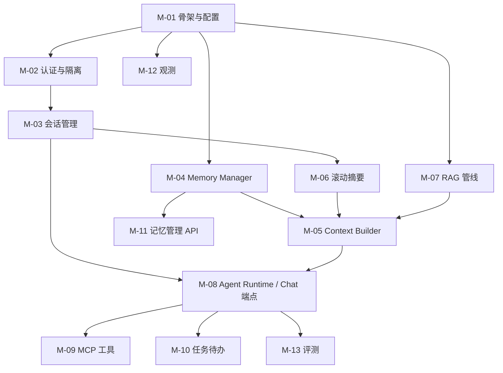

# 模块开发规格书 — memory-service

> 本文档是 memory-service 的**实现级规格**：每个模块给出文件清单、核心接口签名、数据流、配置、测试用例与验收标准（DoD）。开发顺序遵循第 1 章依赖图。
>
> 配套文档：架构与模块职责见 `docs/01`；品牌与前端界面见 `docs/05`；规范见 `docs/02`。
>
> 文档版本：v1.0（2026-09-18） · 服务根目录：`services/memory-service/`

---

## 1. 模块总览与依赖图



| 编号 | 模块 | 里程碑 | 对应 docs/01 章节 |
|---|---|---|---|
| M-01 | 服务骨架与配置 | M1 | §3/§9 |
| M-02 | 认证与 workspace 隔离 | M1 | §5.8 |
| M-03 | 多会话管理 | M2 | §5.1 |
| M-04 | Memory Manager（四层记忆） | M2 | §5.2 |
| M-05 | Context Builder（上下文组装） | M2 | §5.3 |
| M-06 | 滚动摘要 | M2 | §5.4 |
| M-07 | RAG 知识库管线 | M3 | §5.5 |
| M-08 | Agent Runtime 与 Chat 端点 | M1→M3 | §2.3/§5.6 |
| M-09 | MCP 工具 | M3 | §5.6 |
| M-10 | 任务与待办 | M3 | §5.7 |
| M-11 | 记忆管理 API 与用量统计 | M3 | §5.9 |
| M-12 | Langfuse 观测 | M1 起步、M3 全量 | §5.10 |
| M-13 | 评测体系 | M3 | §8 |

## 2. M-00 公共约定（所有模块遵守）

### 2.1 配置体系

- `pydantic-settings`，环境变量前缀 `MEMORY_SERVICE_`，本地读 `deploy/.env` 之外的 `services/memory-service/.env`（git 忽略）
- 配置集中在 `app/core/config.py` 的 `Settings` 类，禁止散落 `os.getenv`

### 2.2 统一错误结构（RFC 7807）

```json
{ "type": "https://echodesk.errors/permission_denied",
  "title": "Permission denied", "status": 403,
  "detail": "workspace 不存在或无访问权限", "trace_id": "uuid" }
```

全局 exception handler 统一包装；业务异常继承 `AppError(code, http_status, detail)`。

### 2.3 trace_id 透传

- 入口中间件生成/读取 `X-Request-ID`，存 `contextvars.ContextVar("trace_id")`
- Langfuse span、日志、响应头、`messages.metadata.trace_id` 全部使用同一值

### 2.4 Schema 命名

`XxxCreate` / `XxxUpdate` / `XxxRead`（响应）/ `XxxReadBrief`（列表项）。响应模型一律含 `id` 与 `created_at`。

### 2.5 数据访问纪律

- 只有 `app/repositories/` 层访问 DB；repository 方法必须接受 `workspace_id` 并写入 WHERE（隔离第一道防线）
- 服务层校验成员资格（第二道）；向量库按 workspace partition（第三道）

---

## 3. M-01 服务骨架与配置

**职责**：可运行的 FastAPI 骨架、配置、日志、健康检查、迁移框架、容器化。

### 文件清单

```
services/memory-service/
├── pyproject.toml              # 依赖 + ruff 配置
├── app/main.py                 # 应用工厂 create_app()
├── app/core/config.py          # Settings（见下表）
├── app/core/logging.py         # 结构化日志（JSON，含 trace_id）
├── app/core/errors.py          # AppError + RFC7807 handler
├── app/core/deps.py            # get_db / get_redis 依赖
├── app/api/routes/health.py    # /healthz /readyz
├── alembic.ini + alembic/      # 迁移框架（env.py 读 Settings）
├── tests/test_health.py        # 冒烟
└── Dockerfile                  # python:3.11-slim，非 root 运行
```

### 核心配置项（Settings）

| 配置 | 默认 | 说明 |
|---|---|---|
| `database_url` | postgresql://...@postgres:5432/workbench | SQLAlchemy URL |
| `redis_url` | redis://redis:6379/0 | 工作记忆 |
| `jwt_secret / jwt_expire_minutes / refresh_expire_days` | — / 30 / 7 | 认证 |
| `llm_base_url / llm_api_key / llm_model` | — | 主模型（OpenAI-compatible） |
| `extractor_model` | 同上可覆写 | 抽取/摘要用便宜模型 |
| `embedding_model` | BAAI/bge-m3 | 向量 |
| `vector_store` | `pgvector`（可选 `milvus`） | 向量后端选择 |
| `langfuse_public_host / langfuse_keys` | — | 观测 |
| `context_budget_profile` | `default` | 上下文预算配置名（A/B 用） |

### 接口

```python
def create_app() -> FastAPI:
    """应用工厂：注册中间件(trace_id/CORS)、异常处理器、路由、观测探针。"""

@router.get("/healthz")   # 存活：进程可响应，不查依赖
@router.get("/readyz")    # 就绪：PG SELECT 1 + Redis PING 全通过才 200
```

### 验收（DoD）

- [ ] `docker compose up -d` 后 `GET :8100/healthz` 200、`/readyz` 200（PG/Redis 健康）
- [ ] alembic 空迁移可 `upgrade head`
- [ ] `ruff check && pytest -q` 通过
- [ ] Dockerfile 构建镜像 < 400MB，容器以非 root 运行

## 4. M-02 认证与 workspace 隔离

**职责**：注册登录、JWT、workspace 成员与 RBAC、隔离三道防线。

### 文件清单

```
app/api/routes/auth.py        # register / login / refresh
app/core/security.py          # 密码哈希(passlib bcrypt)、JWT 编解码
app/core/deps.py              # get_current_user / get_workspace / require_role
app/models/workspace.py / user.py / workspace_member.py
app/repositories/workspace_repo.py
app/schemas/auth.py
tests/test_isolation.py       # ★ 隔离测试（长期保留）
```

### 核心接口

```python
@router.post("/api/auth/register", status_code=201)
async def register(body: UserCreate) -> UserRead:
    """注册用户并创建默认 workspace（同名个人区）。"""

@router.post("/api/auth/login") -> TokenPair   # access + refresh
@router.post("/api/auth/refresh") -> TokenPair

def get_current_user(token: str = Depends(oauth2)) -> User: ...
def get_workspace(ws_id: UUID, user: User = Depends(get_current_user)) -> Workspace:
    """校验 user 是 ws 成员，否则 403（隔离第二道防线）。"""
def require_role(minimum: Role) -> Callable: ...  # member < admin < owner
```

### 关键测试用例

1. 用户 A 带 A 的 token访问 B 的 workspace 资源 → 403
2. repository 层：`workspace_repo.list_sessions(ws_id_b)` 用 A 的上下文查不到（WHERE 强制）
3. 过期/伪造 token → 401；member 角色调管理端点 → 403

### DoD

- [ ] 三用例入 `tests/test_isolation.py` 并通过
- [ ] JWT 过期/刷新流转可用
- [ ] 所有后续路由统一走 `Depends(get_workspace)`

## 5. M-03 多会话管理

**职责**：会话 CRUD、消息持久化、会话恢复、并发安全。

### 文件清单

```
app/api/routes/sessions.py
app/services/session_service.py
app/repositories/session_repo.py / message_repo.py
app/schemas/session.py / message.py
tests/test_sessions.py
```

### 核心接口

```python
class SessionService:
    async def create(self, ws_id: UUID, user: User, title: str | None) -> SessionRead:
        """创建会话；title 为空时先用占位，首条消息后由摘要命名。"""
    async def rename(self, ws_id: UUID, session_id: UUID, title: str) -> SessionRead: ...
    async def archive(self, ws_id: UUID, session_id: UUID) -> None: ...
    async def delete(self, ws_id: UUID, session_id: UUID, cascade_memories: bool = False) -> None:
        """软删除；cascade_memories=True 时同步归档来源记忆。"""
    async def get_with_messages(self, ws_id: UUID, session_id: UUID, page: PageParams) -> SessionDetail: ...
    async def append_message(self, ws_id: UUID, session_id: UUID, msg: MessageCreate) -> MessageRead:
        """追加消息：token 计数、metadata 落库、乐观锁校验(version)。"""

class SessionLock:   # Redis 分布式锁，同会话串行写
    async def __aenter__(self) -> None: ...
```

### 数据流

`POST message` → session 锁 → token 计数 → INSERT → 更新 `sessions.last_message_at/token_total` → 乐观锁冲突则 409。

### DoD

- [ ] 会话 CRUD + 分页消息 API 全通
- [ ] 并发 10 写同会话：无消息丢失、版本冲突返回 409
- [ ] 删除会话后记忆面板"来源"正确显示已删除标记

## 6. M-04 Memory Manager（★ 核心）

**职责**：四层记忆的写入（抽取管线）与读取（检索管线）。

### 文件清单

```
app/memory/
├── store.py               # 统一存储门面
├── working_memory.py      # Redis 近期消息窗口
├── extractor.py           # LLM 结构化抽取
├── deduplicator.py        # 去重（key + 向量相似度）
├── conflict.py            # 冲突检测与仲裁
├── retriever.py           # 检索 + 重排
├── schemas.py             # ExtractedFact / MemoryCandidate / ScoredMemory
├── prompts.py             # 抽取/仲裁 prompt 模板
└── pipeline.py            # 编排：extract_pipeline / retrieve
workers/tasks/extract.py   # Celery 异步任务入口
app/repositories/memory_repo.py / memory_event_repo.py
tests/test_memory_*.py
```

### 核心接口

```python
# ---- 写路径 ----
async def extract_pipeline(ws_id: UUID, session_id: UUID,
                           messages: list[Message]) -> list[MemoryRead]:
    """抽取→打分→去重→冲突→入库；Celery 异步执行，单轮失败不阻塞回答。"""

class MemoryExtractor:
    async def extract(self, messages: list[Message]) -> list[ExtractedFact]:
        """LLM structured output：{key, content, memory_type, confidence, ttl_days?}。
        Raises: LLMTimeoutError —— 调用方降级为跳过本轮。"""

class MemoryDeduplicator:
    async def find_duplicates(self, ws_id: UUID, cand: ExtractedFact) -> Duplicate | None:
        """key 精确匹配 或 向量相似度>0.92；返回旧记忆与相似度。"""

class ConflictResolver:
    async def resolve(self, old: Memory, new: MemoryCandidate) -> ConflictOutcome:
        """LLM 仲裁：SUPERSEDE（旧置 superseded，链版本）/ COEXIST_CONFLICT
        （双条置 conflicted 待用户裁决）/ MERGE（合并提升 confidence）。"""

# ---- 读路径 ----
class MemoryRetriever:
    async def retrieve(self, ws_id: UUID, user_id: UUID, query: str,
                       top_k: int = 8) -> list[ScoredMemory]:
        """向量检索 semantic+episodic → 过滤(active/未过期/归属)
        → 加权重排(sim*0.5 + importance*0.2 + recency*0.15 + hit*0.15)
        → 同 key 去重 → top_k；命中即更新 hit_count。"""

class WorkingMemory:
    async def window(self, session_id: UUID, max_tokens: int) -> list[Message]: ...
    async def append(self, session_id: UUID, msg: Message) -> None: ...
```

### 抽取 JSON Schema（LLM 输出约束）

```json
{ "facts": [
  { "key": "job.字节.进度", "content": "三面通过，等 HR 面",
    "memory_type": "semantic", "confidence": 0.88, "ttl_days": 30,
    "source_message_ids": ["..."] } ] }
```

### 关键测试

1. 注入"我熟悉 LangGraph"→ 新会话提问用户技术栈 → 检索命中该条
2. 同 key 矛盾事实（熟悉/不熟悉前端）→ 旧条 superseded + 版本链完整
3. 仲裁无法判定 → 双条 conflicted
4. TTL 过期记忆不被检索返回
5. 抽取超时 → 回答正常返回，本轮无记忆写入（降级）

### DoD

- [ ] 五用例通过（LLM 用 fake 响应注入）
- [ ] memory_events 完整记录 create/update/conflict/hit/edit_by_user
- [ ] 检索延迟 P95 < 300ms（不含 LLM，fake 向量）

## 7. M-05 Context Builder（★ 核心）

**职责**：token 预算内统一组装各区块上下文。

### 文件清单

```
app/context/
├── budget.py        # ContextBudget 配置加载（config/budgets/*.yaml）
├── builder.py       # ContextBuilder
├── tokenizer.py     # token 计数（tiktoken，模型适配）
└── schemas.py       # ContextSection / ContextCandidate / AssembledContext
app/api/routes/context_debug.py   # POST /api/context/preview
config/budgets/default.yaml / memory_first.yaml / knowledge_first.yaml
tests/test_context_builder.py
```

### 核心接口

```python
class ContextBuilder:
    def assemble(self, candidates: ContextCandidates,
                 budget: ContextBudget) -> AssembledContext:
        """按区块预算装配：system→偏好→事实→摘要→近期消息→RAG→工具结果→当前问题。
        超预算按区块淘汰策略裁剪；输出含每区块实际 token 占用（用于 preview/统计）。"""

@dataclass
class ContextBudget:          # YAML 可配，支持 A/B
    system: int; procedural: int; semantic: int; episodic: int
    working: int; rag: int; tool_results: int; reserve_output: int
    evict_order: list[SectionKey]
```

### 关键测试

1. 各区块超预算时按 evict_order 正确淘汰
2. 总 assembled token 永不超 `window - reserve_output`
3. 同候选集在 default/memory_first 两 profile 下产出可对比（A/B 基础）

### DoD

- [ ] preview 端点返回：完整组装文本 + 各区块 token 明细
- [ ] 预算全走 YAML，无硬编码数字
- [ ] 单元测试覆盖三条淘汰路径

## 8. M-06 滚动摘要

**职责**：单会话上下文压缩。

### 文件清单

```
app/summarizer/rolling.py
app/summarizer/prompts.py
tests/test_summarizer.py
```

### 核心接口

```python
class RollingSummarizer:
    async def maybe_compress(self, ws_id: UUID, session_id: UUID) -> bool:
        """working 累计 token 超阈值(默认 4096)时触发：
        滑出段 → 增量并入 sessions.rolling_summary（缓存命中不重复调模型）
        → 摘要超阈值时二级压缩 → 完成后写 episodic 记忆。返回是否执行。"""
```

### DoD

- [ ] 100 轮脚本对话：每轮注入 token 稳定在预算内（不随轮次线性增长）
- [ ] 摘要增量合并有单测（fake 摘要模型）
- [ ] 会话结束后 Episodic Memory 出现该会话摘要条目

## 9. M-07 RAG 知识库管线

**职责**：文件 → 切片 → 向量 → 混合检索 → 引用。

### 文件清单

```
app/api/routes/knowledge.py       # 上传/列表/删除/检索调试
app/rag/
├── ingest.py        # 解析(pdf/md/docx/txt)→切片(512 token+10% overlap)→embedding→入库
├── chunker.py       # 语义切片（段落感知）
├── retriever.py     # 向量+BM25 → RRF → Rerank top-k
├── citations.py     # 引用结构组装
└── vector_store.py  # pgvector / milvus 双后端适配（同接口）
workers/tasks/ingest_file.py      # Celery 异步摄取
app/repositories/knowledge_repo.py
tests/test_rag_pipeline.py        # 小语料固定断言
```

### 核心接口

```python
class KnowledgeRetriever:
    async def search(self, ws_id: UUID, query: str, top_k: int = 6
                     ) -> list[CitedChunk]:
        """RRF 融合向量与 BM25，rerank 后返回带 file/chunk 定位与分数的片段。"""

async def ingest_file(ws_id: UUID, file: UploadFile) -> FileRead:
    """checksum 去重→异步摄取→状态机 parsing/embedded/failed；同名重传生成新版本。"""
```

### DoD

- [ ] 上传→可问答全链路 < 3min（2MB 文档）
- [ ] 回答 `metadata.citations` 可定位到 chunk，前端展示来源
- [ ] 删除文件后其 chunk 不再被检索命中

## 10. M-08 Agent Runtime 与 Chat 端点

**职责**：OpenAI-compatible SSE 端点 + LangGraph 编排（M1 先直通，M3 完整图）。

### 文件清单

```
app/api/routes/chat.py            # POST /v1/chat/completions (SSE)
app/agent/
├── graph.py          # build_graph()：retrieve→assemble→generate→(tools loop)→postprocess
├── nodes.py          # 节点实现（检索/组装/生成/工具决策）
├── state.py          # GraphState(TypedDict)
└── checkpoint.py     # 会话级快照（恢复中断任务）
app/llm/client.py     # OpenAI-compatible 客户端封装（流式、超时、重试）
tests/test_chat_api.py
```

### 核心接口

```python
@router.post("/v1/chat/completions")
async def chat_completions(body: ChatCompletionRequest,
                           ws: Workspace = Depends(get_workspace)) -> StreamingResponse:
    """兼容 OpenAI 协议；metadata 透传 session_id；
    SSE 事件：delta(正文)/tool_call(带 risk_level，external 需 confirm)/done(含 usage)。"""

def build_graph() -> CompiledGraph:
    """节点：load_context(memory+rag) → assemble → generate(流式)
    → tool_loop(≤8 次迭代) → enqueue_extract(异步记忆抽取)"""

class GraphState(TypedDict):
    session_id: UUID; user_msg: str
    memories: list[ScoredMemory]; rag_chunks: list[CitedChunk]
    assembled: AssembledContext; answer: str
    tool_calls: list[ToolCallRecord]; usage: TokenUsage
```

### LangGraph 防线

工具节点迭代计数 > 8 → 强制收敛为文本回复；节点异常 → 降级回复 + trace 记录 error。

### DoD

- [ ] Open WebUI 配置该端点后可完整对话（SSE 流式）
- [ ] M3：多轮对话中记忆/RAG/工具按图执行，Langfuse trace 树完整
- [ ] 会话中断（重启服务）后可从 checkpoint 恢复

## 11. M-09 MCP 工具

**职责**：工具注册、分级权限、审计、确认流。

### 文件清单

```
app/tools/
├── registry.py       # ToolRegistry：名称/描述/schema/risk_level
├── mcp_client.py     # MCP 协议客户端（stdio/HTTP）
├── router.py         # execute_tool()：权限判断+审计+确认等待
└── builtin/todo.py / search.py / doc_reader.py   # 首批工具
app/repositories/tool_call_repo.py
tests/test_tools.py
```

### 核心接口

```python
class ToolRisk(str, Enum): READ_ONLY = "read_only"; WRITE = "write"; EXTERNAL = "external"

async def execute_tool(ws_id: UUID, session_id: UUID, name: str,
                       args: dict) -> ToolResult:
    """read_only 直接执行；write 执行+审计；external 经 SSE 发 confirm 事件，
    等待用户确认(60s 超时拒绝)；结果超限自动摘要化。全量写 tool_call_logs。"""
```

### DoD

- [ ] "把字节面试准备加到待办" → todo 工具写入 tasks 表且审计可查
- [ ] external 工具未确认 → 超时拒绝，回答告知用户
- [ ] 工具异常不炸会话，降级为文本说明

## 12. M-10 任务与待办

**职责**：Task Continuity 的数据底座（Agent 与前端共用）。

```python
class TaskService:
    async def create/update/list/complete(...) -> TaskRead: ...   # 常规 CRUD
    async def sync_to_memory(self, task: Task) -> None:
        """任务状态变更同步为 semantic 记忆(job.*.progress)，双向一致。"""
    async def active_brief(self, ws_id: UUID) -> list[TaskRead]:
        """高优先未完成任务，供新会话开场注入。"""
```

**DoD**：会话 A 创建任务 → 新会话 B"继续上次的事"能正确引用任务上下文。

## 13. M-11 记忆管理 API 与用量统计

**职责**：面板后端（见 docs/05 §7）。

```
app/api/routes/memories.py     # 列表(过滤/分页)/详情(版本链+来源)/PATCH/DELETE/resolve/search
app/api/routes/usage.py        # GET /api/usage/summary（按区块/会话/日期聚合）
app/services/memory_admin_service.py
```

**DoD**：记忆面板三核心操作（查/改/删）+ 冲突裁决全部可用且落审计；usage summary 支撑看板图表数据。

## 14. M-12 Langfuse 观测

**职责**：全链路 trace（M1 基础埋点起步）。

```
app/observability/tracing.py
```

```python
@contextmanager
def span(name: str, **meta) -> Iterator[Span]: ...   # trace_id 自动关联

# 埋点矩阵（根：chat.turn）
# chat.turn → memory.retrieve / rag.search / context.assemble(各区块token)
#           → llm.call(流式token/首字延迟) → tool.invoke → memory.extract
```

**DoD**：一次对话在 Langfuse 可见完整 span 树；`token_usages` 表与 trace 数据一致（±5%）。

## 15. M-13 评测体系

**职责**：评测集 + 自动 runner + 报告（指标定义见 docs/01 §8）。

```
evals/
├── datasets/long_turn.jsonl     # 50+ 轮长对话（求职场景）
├── datasets/memory_hit.jsonl    # 100 条事实-提问对
├── datasets/conflict.jsonl      # 30 组矛盾事实
├── datasets/task_continuity.jsonl # 20 个跨会话任务
├── run_eval.py                  # 回放→采集注入上下文/回答→指标计算→Markdown 报告
├── judges.py                    # LLM-as-judge（rubric 固定、可复现）
└── README.md                    # 数据格式与复现步骤
```

**DoD**：`python evals/run_eval.py --suite all` 一键产出 9 项指标报告（A/B 两 profile 对比列）；数字可供简历引用（真实测试后填写）。

---

## 16. 开发顺序建议（对齐 14 天计划）

| 顺序 | 模块 | 天 |
|---|---|---|
| 1 | M-01 → M-02 | Day 2 |
| 2 | M-03 | Day 3 |
| 3 | M-04(working) + M-08(直通版) | Day 3–4 |
| 4 | M-06 | Day 5 |
| 5 | M-04(抽取+检索) | Day 6–7 |
| 6 | M-05 | Day 8 |
| 7 | M-11 | Day 9 |
| 8 | M-07 | Day 10 |
| 9 | M-09 + M-10 | Day 11 |
| 10 | M-12 全量 | Day 12 |
| 11 | M-13 | Day 13 |

> 任何模块实现时若与本规格冲突，以"改规格 → 改代码"顺序处理，保证文档始终是唯一事实源。
