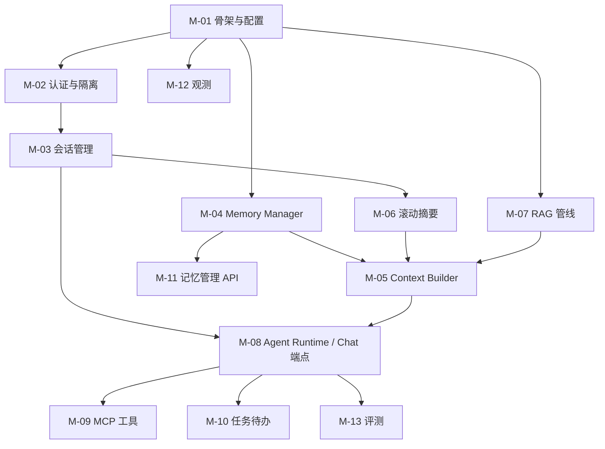

# 模块开发规格书 — memory-service

> 本文档是 memory-service 的**实现级规格**：每个模块给出文件清单、核心接口签名、数据流、配置、测试用例与验收标准（DoD）。开发顺序遵循第 1 章依赖图。
>
> 配套文档：架构与模块职责见 `docs/01`；品牌与前端界面见 `docs/05`；规范见 `docs/02`。
>
> 文档版本：v1.0（2026-09-18） · 服务根目录：`services/memory-service/`

---

## 1. 模块总览与依赖图



| 编号 | 模块 | 里程碑 | 对应 docs/01 章节 |
|---|---|---|---|
| M-01 | 服务骨架与配置 | M1 | §3/§9 |
| M-02 | 认证与 workspace 隔离 | M1 | §5.8 |
| M-03 | 多会话管理 | M2 | §5.1 |
| M-04 | Memory Manager（四层记忆） | M2 | §5.2 |
| M-05 | Context Builder（上下文组装） | M2 | §5.3 |
| M-06 | 滚动摘要 | M2 | §5.4 |
| M-07 | RAG 知识库管线 | M3 | §5.5 |
| M-08 | Agent Runtime 与 Chat 端点 | M1→M3 | §2.3/§5.6 |
| M-09 | MCP 工具 | M3 | §5.6 |
| M-10 | 任务与待办 | M3 | §5.7 |
| M-11 | 记忆管理 API 与用量统计 | M3 | §5.9 |
| M-12 | Langfuse 观测 | M1 起步、M3 全量 | §5.10 |
| M-13 | 评测体系 | M3 | §8 |

## 2. M-00 公共约定（所有模块遵守）

### 2.1 配置体系

- `pydantic-settings`，环境变量前缀 `MEMORY_SERVICE_`，本地读 `deploy/.env` 之外的 `services/memory-service/.env`（git 忽略）
- 配置集中在 `app/core/config.py` 的 `Settings` 类，禁止散落 `os.getenv`

### 2.2 统一错误结构（RFC 7807）

```json
{ "type": "https://echodesk.errors/permission_denied",
  "title": "Permission denied", "status": 403,
  "detail": "workspace 不存在或无访问权限", "trace_id": "uuid" }
```

全局 exception handler 统一包装；业务异常继承 `AppError(code, http_status, detail)`。

### 2.3 trace_id 透传

- 入口中间件生成/读取 `X-Request-ID`，存 `contextvars.ContextVar("trace_id")`
- Langfuse span、日志、响应头、`messages.metadata.trace_id` 全部使用同一值

### 2.4 Schema 命名

`XxxCreate` / `XxxUpdate` / `XxxRead`（响应）/ `XxxReadBrief`（列表项）。响应模型一律含 `id` 与 `created_at`。

### 2.5 数据访问纪律

- 只有 `app/repositories/` 层访问 DB；repository 方法必须接受 `workspace_id` 并写入 WHERE（隔离第一道防线）
- 服务层校验成员资格（第二道）；向量库按 workspace partition（第三道）

---

## 3. M-01 服务骨架与配置

**职责**：可运行的 FastAPI 骨架、配置、日志、健康检查、迁移框架、容器化。

### 文件清单

```
services/memory-service/
├── pyproject.toml              # 依赖 + ruff 配置
├── app/main.py                 # 应用工厂 create_app()
├── app/core/config.py          # Settings（见下表）
├── app/core/logging.py         # 结构化日志（JSON，含 trace_id）
├── app/core/errors.py          # AppError + RFC7807 handler
├── app/core/deps.py            # get_db / get_redis 依赖
├── app/api/routes/health.py    # /healthz /readyz
├── alembic.ini + alembic/      # 迁移框架（env.py 读 Settings）
├── tests/test_health.py        # 冒烟
└── Dockerfile                  # python:3.11-slim，非 root 运行
```

### 核心配置项（Settings）

| 配置 | 默认 | 说明 |
|---|---|---|
| `database_url` | postgresql://...@postgres:5432/workbench | SQLAlchemy URL |
| `redis_url` | redis://redis:6379/0 | 工作记忆 |
| `jwt_secret / jwt_expire_minutes / refresh_expire_days` | — / 30 / 7 | 认证 |
| `llm_base_url / llm_api_key / llm_model` | — | 主模型（OpenAI-compatible） |
| `extractor_model` | 同上可覆写 | 抽取/摘要用便宜模型 |
| `embedding_model` | BAAI/bge-m3 | 向量 |
| `vector_store` | `pgvector`（可选 `milvus`） | 向量后端选择 |
| `langfuse_public_host / langfuse_keys` | — | 观测 |
| `context_budget_profile` | `default` | 上下文预算配置名（A/B 用） |

### 接口

```python
def create_app() -> FastAPI:
    """应用工厂：注册中间件(trace_id/CORS)、异常处理器、路由、观测探针。"""

@router.get("/healthz")   # 存活：进程可响应，不查依赖
@router.get("/readyz")    # 就绪：PG SELECT 1 + Redis PING 全通过才 200
```

### 验收（DoD）

- [ ] `docker compose up -d` 后 `GET :8100/healthz` 200、`/readyz` 200（PG/Redis 健康）
- [ ] alembic 空迁移可 `upgrade head`
- [ ] `ruff check && pytest -q` 通过
- [ ] Dockerfile 构建镜像 < 400MB，容器以非 root 运行

## 4. M-02 认证与 workspace 隔离

**职责**：注册登录、JWT、workspace 成员与 RBAC、隔离三道防线。

### 文件清单

```
app/api/routes/auth.py        # register / login / refresh
app/core/security.py          # 密码哈希(passlib bcrypt)、JWT 编解码
app/core/deps.py              # get_current_user / get_workspace / require_role
app/models/workspace.py / user.py / workspace_member.py
app/repositories/workspace_repo.py
app/schemas/auth.py
tests/test_isolation.py       # ★ 隔离测试（长期保留）
```

### 核心接口

```python
@router.post("/api/auth/register", status_code=201)
async def register(body: UserCreate) -> UserRead:
    """注册用户并创建默认 workspace（同名个人区）。"""

@router.post("/api/auth/login") -> TokenPair   # access + refresh
@router.post("/api/auth/refresh") -> TokenPair

def get_current_user(token: str = Depends(oauth2)) -> User: ...
def get_workspace(ws_id: UUID, user: User = Depends(get_current_user)) -> Workspace:
    """校验 user 是 ws 成员，否则 403（隔离第二道防线）。"""
def require_role(minimum: Role) -> Callable: ...  # member < admin < owner
```

### 关键测试用例

1. 用户 A 带 A 的 token访问 B 的 workspace 资源 → 403
2. repository 层：`workspace_repo.list_sessions(ws_id_b)` 用 A 的上下文查不到（WHERE 强制）
3. 过期/伪造 token → 401；member 角色调管理端点 → 403

### DoD

- [ ] 三用例入 `tests/test_isolation.py` 并通过
- [ ] JWT 过期/刷新流转可用
- [ ] 所有后续路由统一走 `Depends(get_workspace)`

## 5. M-03 多会话管理

**职责**：会话 CRUD、消息持久化、会话恢复、并发安全。

### 文件清单

```
app/api/routes/sessions.py
app/services/session_service.py
app/repositories/session_repo.py / message_repo.py
app/schemas/session.py / message.py
tests/test_sessions.py
```

### 核心接口

```python
class SessionService:
    async def create(self, ws_id: UUID, user: User, title: str | None) -> SessionRead:
        """创建会话；title 为空时先用占位，首条消息后由摘要命名。"""
    async def rename(self, ws_id: UUID, session_id: UUID, title: str) -> SessionRead: ...
    async def archive(self, ws_id: UUID, session_id: UUID) -> None: ...
    async def delete(self, ws_id: UUID, session_id: UUID, cascade_memories: bool = False) -> None:
        """软删除；cascade_memories=True 时同步归档来源记忆。"""
    async def get_with_messages(self, ws_id: UUID, session_id: UUID, page: PageParams) -> SessionDetail: ...
    async def append_message(self, ws_id: UUID, session_id: UUID, msg: MessageCreate) -> MessageRead:
        """追加消息：token 计数、metadata 落库、乐观锁校验(version)。"""

class SessionLock:   # Redis 分布式锁，同会话串行写
    async def __aenter__(self) -> None: ...
```

### 数据流

`POST message` → session 锁 → token 计数 → INSERT → 更新 `sessions.last_message_at/token_total` → 乐观锁冲突则 409。

### DoD

- [ ] 会话 CRUD + 分页消息 API 全通
- [ ] 并发 10 写同会话：无消息丢失、版本冲突返回 409
- [ ] 删除会话后记忆面板"来源"正确显示已删除标记

## 6. M-04 Memory Manager（★ 核心）

**职责**：四层记忆的写入（抽取管线）与读取（检索管线）。

### 文件清单（实际实现）

```
app/memory/
├── working_memory.py      # Redis 近期消息窗口（M1/M-06 已实现）
├── schemas.py             # ExtractedFact / MemoryCandidate / ConflictAction / ConflictOutcome / ScoredMemory
├── prompts.py             # 抽取/仲裁 prompt 模板
├── extractor.py           # LLM 结构化抽取（json_mode + 围栏剥离容错解析）
├── deduplicator.py        # 去重（key 精确 / 向量余弦 ≥0.92 双路径）
├── conflict.py            # 冲突仲裁（merge/supersede/coexist；LLM 失败保守 COEXIST）
├── retriever.py           # 检索 + 加权重排
└── pipeline.py            # 编排：ExtractPipeline + extract_pipeline 工厂
app/llm/embeddings.py      # OpenAI 兼容 embedding 客户端（infinity 承载本地 bge-m3）
app/llm/client.py          # complete(json_mode=) + get_extractor_client 抽取小模型
app/repositories/memory_repo.py  # 抽取/检索全部数据访问（memory_events 流水内聚于此）
app/services/chat_service.py     # 后台抽取挂载（extract_hook 注入式）
tests/test_memory_pipeline.py    # 10 用例（单位正交基向量控制相似度）
alembic/versions/31dc4bbde4c9_*.py  # memories.embedding VECTOR(1024) + HNSW 余弦索引
```

> 与原规格的差异（经用户确认）：异步执行用**进程内 asyncio.create_task**
> （不引入 Celery/ARQ，workers/ 目录暂不建）；memory_event_repo 并入
> memory_repo（事件写入与状态变更内聚一处）；embedding 走本地 infinity
> 服务（宿主 modelscope 模型目录只读挂载），通义 embedding API 为备选。

### 核心接口（实际实现）

```python
# ---- 写路径 ----
async def extract_pipeline(*, ws_id: UUID, user_id: UUID, session_id: UUID,
                           messages: Sequence[tuple[UUID, str, str]]) -> list[Memory]:
    """生产组装入口（自管理 db session，后台任务调用）：
    embedding 未配置立即返回 []；全程异常内部吞掉，绝不阻塞主对话。"""

class MemoryExtractor:
    async def extract(self, messages: list[tuple[UUID, str, str]],
                      *, window: int = 20) -> list[ExtractedFact]:
        """json_mode 请求，transcript 带 [message_id] 标注支撑溯源；
        Raises LLMError/ExtractionError —— 调用方降级为跳过本轮。"""

class MemoryDeduplicator:
    async def find_duplicate(self, db, *, ws_id: UUID, key: str,
                             embedding: list[float] | None) -> Duplicate | None:
        """key 精确命中（similarity=1.0）优先；无向量时仅走 key 路径。"""

class ConflictResolver:
    async def resolve(self, old: Memory, new: ExtractedFact) -> ConflictOutcome:
        """LLM 仲裁：MERGE（合并正文/confidence、version+1）/
        SUPERSEDE（新条挂 supersedes_id 版本链，旧条置 superseded）/
        COEXIST（双条置 conflicted 待用户裁决）；
        失败/解析非法降级 COEXIST（保守不丢信息）。"""

# ---- 读路径 ----
class MemoryRetriever:
    async def retrieve(self, db, *, ws_id: UUID, user_id: UUID, query: str,
                       top_k: int | None = None) -> list[ScoredMemory]:
        """query 向量化 → pgvector HNSW 余弦召回 candidate_k=20
        （active/未过期/semantic+episodic+procedural/归属过滤）
        → 重排(sim*0.5 + importance*0.2 + recency*0.15·30 天半衰期 + hit*0.15·饱和 20)
        → 同 key 保留最高分 → top_k=8 → hit_count+1 + HIT 事件。"""
```

### 抽取 JSON Schema（LLM 输出约束）

```json
{ "facts": [
  { "key": "job.字节.进度", "content": "三面通过，等 HR 面",
    "memory_type": "semantic", "confidence": 0.88, "ttl_days": 30,
    "importance": 0.7, "source_message_ids": ["..."] } ] }
```

> memory_type 合法值 semantic/procedural（episodic 由 M-06 滚动摘要管线负责）；
> confidence < 0.5 的条目在管线层丢弃（控噪）。

### 关键测试（10 用例，全部通过）

1. 注入"我熟悉 LangGraph"→ 检索命中该条（hit_count 与 HIT/CREATED 事件断言）
2. 同 key 矛盾事实 → 旧条 superseded + supersedes_id 版本链完整
3. 仲裁无法判定 → 双条 conflicted
4. TTL 过期记忆不被检索返回（软过期过滤，次近邻可顶替）
5. 抽取 LLM 失败 → 管线降级返回空、无写入、不外抛
6. MERGE：旧条 content/confidence 更新、version=2、不新建条目
7. 低置信度（0.2 < 0.5）抽取结果被丢弃
8. 同 key 多条候选 → 重排后仅保留综合分最高一条
9. 50 条记忆规模检索延迟 < 300ms（fake 向量，不含 LLM）
10. Embedding 服务不可用 → 检索降级返回空列表

### DoD

- [x] 五用例通过（LLM 用 fake 响应注入）—— test_memory_pipeline.py 10/10 全绿
- [x] memory_events 完整记录 create/update/conflict/hit/edit_by_user
      —— CREATED/UPDATED/MERGED/SUPERSEDE/CONFLICT/HIT 事件在用例中断言
- [x] 检索延迟 P95 < 300ms（不含 LLM，fake 向量）—— test_retrieval_latency_under_300ms

## 7. M-05 Context Builder（★ 核心）

**职责**：token 预算内统一组装各区块上下文。

### 文件清单（实际实现）

```
app/context/
├── budget.py        # ContextBudget 加载（config/budgets/*.yaml，占比→绝对 token；fail fast）
├── builder.py       # ContextBuilder + default_builder 工厂 + DEFAULT_SYSTEM_PROMPT
├── tokenizer.py     # count_tokens 启发式计数（中文字符≈1 token，ASCII 词≈0.25；M-04 迁入）
└── schemas.py       # SectionKey / ContextItem / ContextCandidates / SectionUsage / AssembledContext
app/api/routes/context_debug.py   # POST /api/context/preview（成员校验 + 预算明细）
app/schemas/context.py            # preview 请求/响应 Pydantic 模型
app/core/deps.py                  # require_ws_member 公共成员校验（chat 与 preview 共用）
config/budgets/default.yaml / memory_first.yaml / knowledge_first.yaml
tests/test_context_builder.py     # 11 用例
```

预算目录解析顺序：`Settings.budget_config_dir`（容器 `MEMORY_SERVICE_BUDGET_CONFIG_DIR=/app/config/budgets`）→ `<CWD>/config/budgets` → 本文件上溯四级到仓库根 `config/budgets`（本地开发/pytest）；三处均无即 `BudgetConfigError`。compose 只读挂载 `${CONFIG_DIR:-../config}:/app/config`。

### 核心接口（实际实现）

```python
class ContextBuilder:
    def __init__(self, working_memory: WorkingMemory,
                 retriever: MemoryRetriever | None = None): ...

    @staticmethod
    def assemble(candidates: ContextCandidates,
                 budget: ContextBudget) -> AssembledContext:
        """纯函数装配：区块内淘汰（记忆类按 score 降序装满即止；working 从最旧滑窗
        且末条=当前问题必留）→ 全局防线（总量超 available 按 evict_order 整区块放弃，
        system 永不裁剪）→ 渲染：一条合成 system（结构化标签可溯源）+ working 原文 role 消息。"""

    async def build(self, db, *, ws_id, user_id, session_id, query,
                    profile=None, system_prompt=DEFAULT_SYSTEM_PROMPT) -> AssembledContext:
        """高层取数：① sessions.rolling_summary 直取（score=1.0，跳过检索同 key 条目防重复）
        ② MemoryRetriever.retrieve 以 query 检索并按 memory_type 分桶（EmbeddingError 降级为空）
        ③ WorkingMemory 窗口 → assemble。"""

def default_builder(working_memory: WorkingMemory) -> ContextBuilder:
    """默认工厂：embedding 未配置时 retriever=None，降级为"摘要 + 窗口"。"""

@dataclass(frozen=True)
class ContextBudget:              # YAML 写占比，分母 = window − reserve_output
    window_tokens: int            # context_window_tokens（default profile: 4000）
    reserve_output: int
    sections: dict[SectionKey, int]   # system=-1 表示不裁剪；其余为绝对 token 数
    evict_order: tuple[SectionKey, ...]
    profile: str
```

渲染标签格式：`<procedural_memories>/<semantic_memories>/<session_summaries>/<knowledge_chunks>/<tool_results>` 包裹，条目 `<memory type="…" source="key">`、`<summary source="session:<sid>">`、`<knowledge>`、`<tool_result>`；空区块不渲染标签。

### 关键测试（test_context_builder.py，11 例）

1. 纯函数装配 5 例：score 淘汰留高分、working 滑窗保末条、全局 evict 清 RAG 在前、渲染结构与空区块、总量有界 ≤ available
2. 预算加载 2 例：三份 profile 合法且换算正确（default semantic=540 < memory_first 900；knowledge_first RAG 1620）、未知 profile fail fast
3. build 取数 2 例：摘要直取 + 检索分桶注入 + 同 key 去重（fake 检索器）、retriever=None 降级
4. preview 端点 2 例：装配明细往返（sections 顺序与 SectionKey 一致、total ≤ available）、鉴权防线（401/404/422/403）

### DoD

- [x] preview 端点返回：完整组装文本 + 各区块 token 明细 —— 实机验证 default profile window=4000/available=3600，各区块预算 180/540/360/1080/900/360 与 YAML 占比一致
- [x] 预算全走 YAML，无硬编码数字 —— 占比换算在 budget.py，测试经仓库根目录探测读真实三份 YAML
- [x] 单元测试覆盖三条淘汰路径 —— 区块内 score 淘汰 / working 滑窗 / 全局 evict_order 各有独立用例；另实机验证跨会话记忆注入（会话 A 喂入的姓名/语言偏好在会话 B 准确回答，semantic 区块 2 条 memory 标签可溯源）

## 8. M-06 滚动摘要

**职责**：单会话上下文压缩。

### 文件清单

```
app/summarizer/rolling.py
app/summarizer/prompts.py
tests/test_summarizer.py
```

### 核心接口（实际实现）

```python
class RollingSummarizer:
    async def maybe_compress(self, db: AsyncSession, *, ws_id: UUID, session_id: UUID) -> bool:
        """每轮回答落库后由 ChatService.finalize 触发：
        全量与 token 预算窗口(默认 4000)的差集即滑出段，非空才继续（缓存命中零调用）
        → 旧摘要 + 滑出段 LLM 增量合并 → 摘要超预算(800)时二级压缩
        → 落 sessions.rolling_summary + upsert episodic 记忆(session_summary:<sid>，version 自增)
        → LTRIM 窗口衔接（摘要与窗口不重不漏）。全程持有会话分布式锁，
        锁竞争/异常降级返回 False 不影响主对话。"""
```

### DoD

- [x] 100 轮脚本对话：每轮注入 token 稳定在预算内（不随轮次线性增长）
      —— test_hundred_rounds_context_bounded 每轮断言上下文 ≤ 上界
- [x] 摘要增量合并有单测（fake 摘要模型）—— 含缓存命中零调用、二级压缩、upsert 幂等共 5 例
- [x] 会话结束后 Episodic Memory 出现该会话摘要条目 —— 压缩完成即写（无需等会话结束），实机验证 version 随压缩次数自增

## 9. M-07 RAG 知识库管线

**职责**：文件 → 切片 → 向量 → 混合检索 → 引用。

### 文件清单

```
app/api/routes/knowledge.py       # 上传/列表/删除/检索调试
app/rag/
├── ingest.py        # 解析(pdf/md/docx/txt)→切片(512 token+10% overlap)→embedding→入库
├── chunker.py       # 语义切片（段落感知）
├── retriever.py     # 向量+BM25 → RRF → Rerank top-k
├── citations.py     # 引用结构组装
└── vector_store.py  # pgvector / milvus 双后端适配（同接口）
workers/tasks/ingest_file.py      # Celery 异步摄取
app/repositories/knowledge_repo.py
tests/test_rag_pipeline.py        # 小语料固定断言
```

### 核心接口

```python
class KnowledgeRetriever:
    async def search(self, ws_id: UUID, query: str, top_k: int = 6
                     ) -> list[CitedChunk]:
        """RRF 融合向量与 BM25，rerank 后返回带 file/chunk 定位与分数的片段。"""

async def ingest_file(ws_id: UUID, file: UploadFile) -> FileRead:
    """checksum 去重→异步摄取→状态机 parsing/embedded/failed；同名重传生成新版本。"""
```

### 实际实现说明（收官同步）

```
app/rag/
├── parser.py        # pypdf/python-docx/md/txt → 纯文本（白名单外 422）
├── chunker.py       # 段落贪心 + 标题边界 + 句子级退化 + 10% 尾段 overlap
├── tokenizer.py     # jieba cut_for_search 预分词（BM25 索引源）
├── lexical.py       # rank_by_bm25（rank_bm25，Python 侧现场建索引）
├── retriever.py     # 双路召回 → RRF(60) → rerank(max(3k,20) 候选) → top_k
├── ingest.py        # asyncio.create_task 后台补向量（非 Celery，M1 单机口径）
└── schemas.py       # CitedChunk（frozen dataclass）
app/llm/rerank.py                  # RerankClient（infinity /rerank，失败降级 RRF 直排）
app/schemas/knowledge.py           # 文件/检索/Citation 模型
app/services/knowledge_service.py  # 上传/版本链/删除/检索编排
app/repositories/knowledge_repo.py # chunks 冗余 workspace_id + tokens JSONB
app/context/builder.py             # RAG 区块注入 + citations 与预算对齐
evals/rag_recall.py + data/        # Recall@K 冒烟评测（10 条查询）
alembic 5de8d97c8e0d               # embedding/tokens/workspace_id + HNSW 索引
tests/test_rag_pipeline.py         # 18 例
```

关键口径：

- **摄取方案**：请求内同步完成解析+切片+分词+入库（状态 parsing），embedding 由
  `asyncio.create_task` 后台补齐后置 embedded、失败置 failed 可重传重试；
  service 显式 `commit` 后再 spawn（防后台会话读不到未提交行）
- **双路检索**：向量路 pgvector cosine（`embedding IS NOT NULL` 天然排除下线版本）
  + BM25 路（tokens JSONB 现场建索引）；RRF `Σ 1/(60+rank)` 融合 → rerank 候选取
  `max(top_k*3, 20)` → bge-reranker-large 精排，**任何一路失败降级另一路直排**
- **BM25 小语料平滑**：索引附加两个空文档根治 idf 退化（idf>0 要求 N>2×freq，
  个人工作台初期语料小，不加平滑会全量过滤为 0 命中）
- **版本语义**：同名重传 version+1，旧 file 置 superseded 且 chunks 双路下线
  （embedding NULL + tokens 清空，文本保留可追溯）；checksum 命中幂等返回已有文件
- **citations 对齐**：`AssembledContext.citations` 只含预算内真正注入的 chunk
  （`_pack_scored` 纯函数重放过滤），chat 流式 finish / 非流式 metadata 均回传
- **模型名教训**：infinity `--model-id` 为挂载路径时注册名规范化为 repo id
  （`/data/BAAI/bge-m3` → `BAAI/bge-m3`），客户端用路径式名会 400 且静默降级——
  曾导致向量路全程 BM25-only，已修（compose/config/.env.example/手册 6 处）

### DoD

- [x] 上传→可问答全链路 < 3min（2MB 文档）—— 实机验证：上传至 embedded 6~7s；10 条真实查询 Recall@5=100%、MRR=1.000（bge-m3 向量路 + bge-reranker 精排全开）
- [x] 回答 `metadata.citations` 可定位到 chunk，前端展示来源 —— 实机验证：非流式 metadata.citations 与流式 finish 分片均带 filename/chunk_index/chunk_id；测试覆盖预算裁剪后不引用未注入内容
- [x] 删除文件后其 chunk 不再被检索命中 —— 实机验证：删除 204 后列表仅剩 superseded 旧版（文本可追溯）、检索零命中；同名重传版本链 version=2/旧版下线一并核验

## 10. M-08 Agent Runtime 与 Chat 端点

**职责**：OpenAI-compatible SSE 端点 + LangGraph 编排（M1 先直通，M3 完整图）。

### 文件清单

```
app/api/routes/chat.py            # POST /v1/chat/completions (SSE)
app/agent/
├── graph.py          # build_graph()：retrieve→assemble→generate→(tools loop)→postprocess
├── nodes.py          # 节点实现（检索/组装/生成/工具决策）
├── state.py          # GraphState(TypedDict)
└── checkpoint.py     # 会话级快照（恢复中断任务）
app/llm/client.py     # OpenAI-compatible 客户端封装（流式、超时、重试）
tests/test_chat_api.py
```

### 核心接口

```python
@router.post("/v1/chat/completions")
async def chat_completions(body: ChatCompletionRequest,
                           ws: Workspace = Depends(get_workspace)) -> StreamingResponse:
    """兼容 OpenAI 协议；metadata 透传 session_id；
    SSE 事件：delta(正文)/tool_call(带 risk_level，external 需 confirm)/done(含 usage)。"""

def build_graph() -> CompiledGraph:
    """节点：load_context(memory+rag) → assemble → generate(流式)
    → tool_loop(≤8 次迭代) → enqueue_extract(异步记忆抽取)"""

class GraphState(TypedDict):
    session_id: UUID; user_msg: str
    memories: list[ScoredMemory]; rag_chunks: list[CitedChunk]
    assembled: AssembledContext; answer: str
    tool_calls: list[ToolCallRecord]; usage: TokenUsage
```

### LangGraph 防线

工具节点迭代计数 > 8 → 强制收敛为文本回复；节点异常 → 降级回复 + trace 记录 error。

### 实际实现说明（收官同步）

```
app/agent/graph.py               # build_graph(checkpointer)：generate ⇄ tool_node 循环 + 收敛边
app/agent/nodes.py               # generate（LLM 协议轮/收敛轮 + external PENDING 前置）/ tool_node（interrupt/执行/回灌）
app/agent/state.py               # GraphState + GraphContext（经 configurable["ctx"] 注入，不进 checkpoint）
app/agent/checkpoint.py          # AgentRuntime：AsyncPostgresSaver（agent_ckpt schema）+ InMemorySaver 降级
app/llm/client.py                # stream_chat_with_tools 流式 function calling（StreamTurn/ToolCallRequest）
app/api/routes/chat.py           # POST /v1/chat/completions（enable_tools 开关）+ POST /v1/chat/resume
app/tools/mcp_client.py          # MCP 外部 server 接入（详见 §11 M-09 收官同步）
deploy/pipes/echodesk_memory.py  # Pipe v0.3：tool_call 事件转确认提示 + 确认词短路 resume
tests/test_agent_graph.py        # 8 例（7 链路 + PostgresSaver 集成断言）
```

关键口径（含实机踩坑实录）：

- **interrupt 副作用前置原则**：external 工具的 PENDING 审计落库（commit）+ SSE `tool_call` 事件都在 **generate 节点**完成（checkpoint 边界之前）；tool_node 里只调 `interrupt()`。恢复时图从 generate 后重放，副作用不重复——这是幂等的关键设计，若把审计放 tool_node 则每次 resume 重跑都会再插一行
- **ctx 与 checkpoint 的分离**：GraphContext（db 会话/llm/回调闭包）经 `config["configurable"]["ctx"]` 注入，不进 checkpoint（不可序列化也不该持久化）；`/v1/chat/resume` 端点用新请求的 db 会话重建 ctx，同 thread_id 发 `Command(resume={"call_id", "approve"})`
- **thread_id** = `f"{workspace_id}:{session_id}"`——workspace 隔离 + 会话级恢复粒度
- **checkpoint 生产三坑**（首启日志 `agent_checkpoint_degraded` 抓出）：① psycopg 池连接必须 `autocommit=True`（langgraph 官方约定：setup() 的 `CREATE INDEX CONCURRENTLY` 在事务块内直接失败）；② 业务库 M-06 已有摘要检查点表 `checkpoints`（public schema），LangGraph 同名表被 `IF NOT EXISTS` 静默跳过后建索引报 `column "thread_id" does not exist` → 连接级 `options="-c search_path=agent_ckpt"` 落独立 schema（`sql.Identifier` 参数化建 schema，checkpoint 表整体不进 Alembic）；③ `AsyncConnectionPool(open=True)` 构造期打开已弃用 → `open=False` + `await pool.open()`，且失败分支必须 `pool.close()` 回收（否则后台 worker task 悬挂）
- **Windows 单测特例**：psycopg 异步不支持 ProactorEventLoop → PostgresSaver 集成断言用 sync 测试 + `WindowsSelectorEventLoopPolicy` + `asyncio.run` 自管循环（生产 Linux 容器无此问题）
- **usage 语义变化**：M3 后非流式对话也走图（`stream_chat_with_tools`），"上游 usage 优先、缺失本地估算"的判定按协议轮 done 事件携带的 usage 逐轮累加——`test_usage` 的 FakeLLM 以 `stream_usage` 参数区分两种语义
- **SSE 事件契约**：`delta`（正文增量）/ `metadata.tool_call`（`{call_id, tool, args, risk}`，external 确认请求）/ `error`（上游降级）/ `done`（usage + session_id 映射）
- **MCP 接入（D1 决策）**：外部工具默认 `risk=external`（Settings.mcp_tool_risk 可整体放宽）；每 server 一条后台 task 长连接（stdio / streamable HTTP 双 transport），启动期 `list_tools` 后以 `mcp.<server>.<tool>` 前缀注册；JSON Schema → Pydantic 动态参数模型（非 Python 标识符属性名经 alias 承载、`by_alias` 转发还原远端原名）；单 server 连接失败仅告警跳过（部分降级，不炸启动）
- **Pipe v0.3 确认流**：`tool_call` 事件转为引用块确认提示；用户回复确认词（同意/批准/确认执行/approve/yes ↔ 拒绝/不同意/取消执行/deny/no，strip+lower 完全匹配防误触）短路走 `/v1/chat/resume`；**非确认词视为放弃**——清除挂起映射，旧调用保持 PENDING 终态不执行（安全侧失效）；`_open_stream` 返回 `(client, resp)` 元组修 v0.2 流式连接泄漏

### DoD

- [x] Open WebUI 配置该端点后可完整对话（SSE 流式）—— 2026-09-18 经 Pipe 实测通过
- [x] M3：多轮对话中记忆/RAG/工具按图执行，Langfuse trace 树完整 —— 2026-09-19 实机：7 span 矩阵完整（chat.turn → context.assemble / memory.retrieve / rag.search → llm.call×轮数 → tool.invoke → memory.extract），工具循环每轮 GENERATION 可见、deny 路径无 tool.invoke（语义正确）；测试基线 163 passed（136 基线 + 6 LLM 协议 + 8 agent 图 + 13 MCP）
- [x] 会话中断（重启服务）后可从 checkpoint 恢复 —— 2026-09-19 实机：两次 external 挂起 → `docker restart` → `/v1/chat/resume` approve 成功恢复并真实执行 web.fetch（抓取 example.com）/ deny 正确收敛拒绝——新进程能恢复即排除 InMemorySaver，PostgresSaver 持久化实证；容器日志 `agent_checkpoint_backend=postgres`

## 11. M-09 MCP 工具

**职责**：工具注册、分级权限、审计、确认流。

### 文件清单

```
app/tools/
├── registry.py       # ToolRegistry：名称/描述/schema/risk_level
├── mcp_client.py     # MCP 协议客户端（stdio/HTTP）
├── router.py         # execute_tool()：权限判断+审计+确认等待
└── builtin/todo.py / search.py / doc_reader.py   # 首批工具
app/repositories/tool_call_repo.py
tests/test_tools.py
```

### 核心接口

```python
class ToolRisk(str, Enum): READ_ONLY = "read_only"; WRITE = "write"; EXTERNAL = "external"

async def execute_tool(ws_id: UUID, session_id: UUID, name: str,
                       args: dict) -> ToolResult:
    """read_only 直接执行；write 执行+审计；external 经 SSE 发 confirm 事件，
    等待用户确认(60s 超时拒绝)；结果超限自动摘要化。全量写 tool_call_logs。"""
```

### 实际实现说明（收官同步）

```
app/tools/registry.py           # ToolDefinition(name/description/risk/args_model/handler) + ToolRegistry
app/tools/router.py             # execute_tool/confirm_tool_call + _wait_confirm_and_execute 后台任务
app/tools/mcp_client.py         # MCP 接入（M-08 M3 落地：连接池/动态注册/降级，详见 §10）
app/tools/builtin/todo.py       # todo.create/list/update/complete（write，经 TaskService）
app/tools/builtin/doc_reader.py # doc.read（read_only，读知识库最新版全文）
app/tools/builtin/web_fetch.py  # web.fetch（external，流式限额抓取 + HTML 抽正文）
app/repositories/tool_call_repo.py  # create_log/get_log/list_logs（ws 隔离，created_at desc）
app/schemas/tool.py             # ToolInfo/ToolExecuteRequest/ToolExecutionRead/ToolConfirmRead/ToolCallRead
app/api/routes/tools.py         # GET /api/tools、POST /execute(202/200)、POST /calls/{id}/confirm、GET /calls
tests/test_tools.py             # 10 例
```

关键口径：

- **确认流实现**：external → 落 PENDING 审计并**先 commit**（后台任务用独立会话读行，M-07 同款竞态教训）→ 返回 202 + `requires_confirmation`；确认经 Redis `tool:confirm:{call_id}`（TTL=窗口+30s）通知，后台任务 1s 轮询 → approve 执行 / deny 拒绝 / 超时（默认 60s，`tool_confirm_timeout_seconds`）TIMEOUT 拒绝；终态全落审计（SSE 通道已于 M-08 M3 落地：图内 generate 节点直发 tool_call 事件 + `/v1/chat/resume` 裁决，见 §10）
- **handler 契约**：`handler(db, *, ws_id, user, session_id, args)`，args 为 Pydantic 实例（`_validate_args` 统一 422）；后台路径用 `_minimal_user(user_id)` 瞬态 User（仅身份字段，不落库）
- **结果摘要化**：`digest_result` JSON 序列化后超 `tool_result_max_chars`(2000) 截断标注；工具异常**不炸调用方**——立即路径 200 + `status=failed` + error 文本，确认流路径后台落 FAILED（蟑螂排查同款：异常路径均有审计）
- **httpx 坑**：响应编码属性是 `charset_encoding`（`charset` 是 requests 的 API，实机验证抓出）；web.fetch 流式累计至 `web_fetch_max_bytes` 断开、`_TextExtractor` 跳过 script/style 抽正文
- **StrEnum 坑**：`tool_call_logs.status` 为 String 列，DB 回读是 str——比较必须 `==`/`!=` 不能 `is`（confirm 409 与后台幂等判断均按此实现）
- **M3 边界（诚实声明，已于 M-08 M3 收官解除）**：`mcp_client.py`（stdio/HTTP 外部 MCP 服务器接入）与 LLM 自动 tool-loop（LangGraph 内工具循环 + interrupt 确认流）已在 M-08 M3 实现——实现口径见 §10 收官同步；M-09 本章的 REST 直调路径（POST /execute + confirm）保留，作为前端/Pipe 手动触发与审计查询通道，与图内自动循环共用 registry/execute_tool/审计

### DoD

- [x] "把字节面试准备加到待办" → todo 工具写入 tasks 表且审计可查 —— 单测 + 实机：todo.create 200/SUCCESS、tasks 表可查、`tool_call_logs` 含 args/result_digest/session_id
- [x] external 工具未确认 → 超时拒绝，回答告知用户 —— 单测 TIMEOUT 终态（压缩窗口）；实机验证 approve→SUCCESS（web.fetch 真实出网抓取 example.com）/ deny→DENIED 两条主路径
- [x] 工具异常不炸会话，降级为文本说明 —— todo.update 不存在任务 → 200 + `status=failed` + "任务"错误文本，审计落 FAILED

## 12. M-10 任务与待办

**职责**：Task Continuity 的数据底座（Agent 与前端共用）。

```python
class TaskService:
    async def create/update/list/complete(...) -> TaskRead: ...   # 常规 CRUD
    async def sync_to_memory(self, task: Task) -> None:
        """任务状态变更同步为 semantic 记忆(job.*.progress)，双向一致。"""
    async def active_brief(self, ws_id: UUID) -> list[TaskRead]:
        """高优先未完成任务，供新会话开场注入。"""
```

**DoD**：会话 A 创建任务 → 新会话 B"继续上次的事"能正确引用任务上下文。

### 实际实现说明（收官同步）

```
app/repositories/task_repo.py       # create/get/list/unfinished_brief（priority desc + updated_at desc）
app/repositories/memory_repo.py     # task_progress_key + upsert_task_progress（复用 M-06 upsert 模式）
app/services/task_service.py        # CRUD + sync_to_memory + active_brief + _refresh_embedding
app/schemas/task.py                 # TaskCreate/TaskUpdate/TaskRead
app/api/routes/tasks.py             # GET/POST /api/tasks、PATCH /{task_id}（session_id query 挂链）
app/context/builder.py              # ②.2 任务简报注入 semantic 桶（source=task:<id>，score=0.95）
tests/test_tasks.py                 # 4 例
```

关键口径：

- **user_id 贯通**：`memories.user_id` 非空——REST 路由（`user.id`）、todo 工具（即时/后台路径均有 `.id`）→ `TaskService` → `upsert_task_progress` 全链路显式传递；进度记忆归属首个操作者（workspace 内共享，检索不做 user 过滤）
- **记忆同步**：key=`job:<task_id>.progress`、semantic/confidence 0.9/importance 0.8/source=SYSTEM；每次变更 version+1、TTL 30 天滑动顺延（活跃任务不过期）；文案 `任务「标题」open → doing（优先级 N）`；向量尽力刷新（EmbeddingError 降级保留旧向量）
- **PATCH 语义**：`payload.model_fields_set` 区分"due_date 未提交"（不动）与"提交 null"（清除）；状态/标题变更才触发记忆同步（priority/due 变更不写记忆，避免版本链噪音）
- **String 列枚举坑**：`tasks.status` 为 String(16) 列，DB 回读是 str——展示前统一 `TaskStatus(task.status).value` 归一（sync 文案与 builder 注入两处，蟑螂法则一并修正）；比较用 `==`
- **简报注入**：`ContextBuilder.build()` 在 episodic 之后注入（②.2），复用 semantic 桶的预算/裁剪/去重管线；仅 OPEN/DOING 进简报，DONE 排除；条数受 `task_brief_limit`(5) 约束

### DoD

- [x] 会话 A 创建任务 → 新会话 B"继续上次的事"能正确引用任务上下文 —— 单测：简报进 semantic 桶（`SectionUsage.included≥1`）、已完成不注入、排序 `[高优, 普通]`；实机：POST /api/tasks（挂 session）→ PATCH doing → `job:` 记忆含 "open → doing" → preview 系统提示含 "未完成任务「整理季度 OKR」"

## 13. M-11 记忆管理 API 与用量统计

**职责**：面板后端（见 docs/05 §7）。

```
app/api/routes/memories.py     # 列表(过滤/分页)/详情(版本链+来源)/PATCH/DELETE/resolve/search
app/api/routes/usage.py        # GET /api/usage/summary（按区块/会话/日期聚合）
app/services/memory_admin_service.py
```

**DoD**：记忆面板三核心操作（查/改/删）+ 冲突裁决全部可用且落审计；usage summary 支撑看板图表数据。

### 实际实现说明（收官同步）

```
app/schemas/memory.py          # MemoryRead/Detail/Update/ResolveRequest/SearchRequest/SearchHit
app/schemas/usage.py           # UsageTotals(total_tokens 为 computed_field)/DayItem/SummaryResponse
app/repositories/memory_repo.py  # M-11 段：list_memories/get_by_id/version_chain/events_of/
                                 #   edit_by_user/soft_delete/find_conflict_peer/resolve_conflict
app/repositories/usage_repo.py   # record_turn（chat 落库）/summary（SQL 聚合）
services/chat_service.py       # _build_context 抽取共用；finalize 增 assembled/usage 参数落用量
tests/test_memory_admin.py     # 12 例
tests/test_usage.py            # 5 例
```

关键口径：

- **列表**：软删除恒排除；排序 `case(status==conflicted → 0)` 置顶 + `updated_at desc`；关键词对 key/content ILIKE。路由注册顺序 `/search` 必须先于 `/{memory_id}`（否则 "search" 被当 UUID 解析 422）
- **编辑**：`payload.model_fields_set` 区分"未提交 expires_at"与"提交 null"（null 清除 TTL）；无任何变更时不落版本与审计；向量尽力刷新（EmbeddingError 降级保留旧向量，与 merge 口径一致）
- **裁决**：`keep=this|other`；winner 回 ACTIVE、`winner.supersedes_id` 为空时指向 loser（已有链不覆盖）、loser 置 SUPERSEDED；两条事件 source 均记 USER（区别于抽取管线自动仲裁）
- **用量**：区块明细取 M-05 `AssembledContext.sections`（memory=procedural+semantic+episodic）；prompt/completion 优先上游 usage（非流式），流式缺失时本地 `count_tokens` 估算；turn_no=max+1；cost_usd 恒 0（价目表 M-12 引入）
- **summary 日界**：`created_at AT TIME ZONE 'UTC'` 后再 `date_trunc`——PG 会话 TimeZone（Asia/Shanghai）与 asyncpg 的 UTC 解码不一致时，直接截断会让 by_day 整体偏移一天；统一 UTC 口径，本地化展示由前端换算
- **写后序列化**：`updated_at` 为 server 侧 onupdate，flush 后过期，Pydantic 序列化访问会触发 lazy IO（MissingGreenlet）——update/resolve/delete 返回前 `await db.refresh(memory)`

### DoD

- [x] 记忆面板三核心操作（查/改/删）+ 冲突裁决全部可用且落审计 —— 实机验证：列表 conflicted 过滤/置顶、详情版本链含对手方、PATCH version+1 + `edit_by_user/user` 事件、resolve winner=active+挂链 loser=superseded、DELETE 204 幂等
- [x] usage summary 支撑看板图表数据 —— 实机验证真实 chat 一轮：token_usages 落 turn_no=1、上游 usage 114/34；summary turns=1/prompt=114/completion=34/total=148/by_day 1 条；单测覆盖流式本地估算与区块明细（memory_tokens>0、rag/tool=0）

## 14. M-12 Langfuse 观测

**职责**：全链路 trace（M1 基础埋点起步）。

```
app/observability/tracing.py
```

```python
@contextmanager
def span(name: str, **meta) -> Iterator[Span]: ...   # trace_id 自动关联

# 埋点矩阵（根：chat.turn）
# chat.turn → memory.retrieve / rag.search / context.assemble(各区块token)
#           → llm.call(流式token/首字延迟) → tool.invoke → memory.extract
```

**DoD**：一次对话在 Langfuse 可见完整 span 树；`token_usages` 表与 trace 数据一致（±5%）。

### 实际实现说明（收官同步）

```
app/observability/__init__.py    # 包导出（tracing + pricing）
app/observability/tracing.py     # SDK 封装：turn/span/generation + no-op 降级 + snippet 截断
app/observability/pricing.py     # pricing.yaml 加载 + cost_usd_for(Decimal 6 位)
config/pricing.yaml              # qwen-plus/turbo/max 价目（USD/1K tokens，阿里云公开价折算）
app/api/routes/chat.py           # chat.turn 根 span（非流式分支 + 流式 event_stream 各一层）
app/services/chat_service.py     # context.assemble（区块 token 明细 metadata）
app/context/builder.py           # memory.retrieve / rag.search（query 片段 + hits 数）
app/llm/client.py                # llm.call = as_type="generation"（usage/output/流式 ttfb+chars）
app/tools/router.py              # tool.invoke 两路径（immediate / confirmed 确认流）
app/memory/pipeline.py           # memory.extract（后台 task 经 contextvars 挂同一 trace 根）
app/repositories/usage_repo.py   # record_turn 按价目表折算 cost_usd（M-11 遗留恒 0 补齐）
app/main.py                      # lifespan 退出时 shutdown_flush（同步 flush+释放）
deploy/docker-compose.yml        # Langfuse v3 六服务（profile=observability，web 3001）
deploy/langfuse/clickhouse-memory.xml  # CH 内存上限 1.5GB（WSL2 小内存防 OOM）
tests/test_tracing.py            # 6 例（no-op/snippet/价目/cost 落库/trace_id hex 归一）
```

关键口径（含实机踩坑实录）：

- **SDK v4（4.15.x）API 与常见教程差异**：`client.start_as_current_observation(name=, as_type=, metadata=, model=, trace_context=)` 返回可 with 的 agnostic contextmanager；trace 级属性（session_id/user_id/tags/trace_name）必须用模块级 `propagate_attributes(...)`（span.update 传 session_id 会被静默忽略）；`TraceContext(trace_id=...)` 来自 `langfuse.types`
- **trace_id 必须 32 位无连字符 hex**：SDK 内部 `int(trace_id, 16)` 解析，带连字符的标准 UUID 串直接 ValueError → chat 500。`_resolve_trace_id` 用 `UUID(x).hex` 归一（单测锁定此行为）
- **model/usage_details 仅 as_type="generation" 生效**（span 类型忽略）；span `update(metadata=...)` 会整体覆盖，动态指标须在退出前一次性 update 全部键
- **Langfuse v4 服务端查询 API**：`GET /api/public/traces` 已移除（404），改用 `GET /api/public/v2/observations?sessionId=<sid>&fields=basic,metadata,io,usage,model`；**fields 必须显式请求**——默认响应不含 metadata/usage/model 组（文档称默认 all 与实测不符，非法 fields 值会被静默过滤）
- **部署三坑**：① `CLICKHOUSE_CLUSTER_ENABLED: "false"` 必须显式（否则镜像 :4 迁移带 ON CLUSTER 子句，单机 CH 报 code 139）；② `NEXTAUTH_SECRET` 仅 web 必需（zod fail fast；YAML 锚点 `&langfuse-env` 定义在 web、worker `<<:` 引用——锚点须先定义后引用）；③ web/worker **不可设 1G 容器 limit**（Node 启动迁移期堆溢出 → crash 循环；VM 内存充足时直接不限，CH 保留 2G）
- **WSL2 内存适配**：VM 4GB→8GB（`~/.wslconfig`）+ CH `config.d` 限 1.5GB；engine 崩溃自愈后宿主端口转发可能错乱（宿主连 5432 报 InvalidPassword 但容器内正常）——`docker restart workbench-postgres` 重注册映射即修复
- **no-op 降级与测试盲区**：三项配置（host/public_key/secret_key）任一为空 → `_NullObservation` 全链路零分支；但本地测试全在 no-op 下跑，SDK 真实交互（如 trace_id 解析）只能实机暴露——**观测类改动必须实机验证 DoD 后才可收官**

### DoD

- [x] 一次对话在 Langfuse 可见完整 span 树 —— 实机验证：sessionId 过滤返回 7 observation（chat.turn → context.assemble → memory.retrieve + rag.search → llm.call×2（chat 主调用 + extract）→ memory.extract），后台抽取 span 经 contextvars 正确挂在同一 trace 根下
- [x] token_usages 与 trace 数据一致（±5%）—— 实机验证：chat 主调用 DB 行 114/44 vs Langfuse llm.call usageDetails input=114/output=44 **零偏差**；extract 调用 507/5 亦上报；cost_usd=0.000025 > 0（qwen-plus 价目折算）
- [x] 未配置 Langfuse 时 no-op 降级不破坏既有链路 —— 117/117 全绿（111 基线 + 6 新增）

## 15. M-13 评测体系

**职责**：评测集 + 自动 runner + 报告（指标定义见 docs/01 §8）。

```
evals/
├── datasets/long_turn.jsonl     # 50+ 轮长对话（求职场景）
├── datasets/memory_hit.jsonl    # 100 条事实-提问对
├── datasets/conflict.jsonl      # 30 组矛盾事实
├── datasets/task_continuity.jsonl # 20 个跨会话任务
├── run_eval.py                  # 回放→采集注入上下文/回答→指标计算→Markdown 报告
├── judges.py                    # LLM-as-judge（rubric 固定、可复现）
└── README.md                    # 数据格式与复现步骤
```

**DoD**：✅ `python evals/run_eval.py --suite all` 一键产出 9 项指标报告（✅ A/B 两 profile 对比列，default 与 memory_first 两轮实测）；数字可供简历引用（见 evals/reports/ 与上文实测表）。

### 实际实现说明（收官同步）

**文件清单**（种子规模，格式支持扩到设计全量）：

```
evals/
├── datasets/long_turn.jsonl       # 2 组 × 30 轮（求职/转岗场景，信息梯度：背景→偏好→弱项→变化）
├── datasets/memory_hit.jsonl      # 20 条事实-探针对（含陷阱关键词，量化误注入）
├── datasets/conflict.jsonl        # 8 组新旧事实（手机号/岗位/城市/薪资/技术栈等）
├── datasets/task_continuity.jsonl # 4 个跨会话任务（断言关键词全部写进 title）
├── metrics.py                     # 规则指标纯函数（Recall@5/Precision/Conflict/percentile/聚合）
├── judges.py                      # LLM-as-judge：走 /v1/tasks/completions，rubric 固定 + JSON 输出
├── run_eval.py                    # 主引擎：注册评测账号 → 回放 → 采集 → 报告（md + json 双格式）
├── README.md                      # 数据格式 / 复现步骤 / 扩充指南 / 口径说明
└── reports/                       # 历次报告入库留存
```

**关键口径**：

1. **注入条目解析**：`/api/context/preview` 的 messages 中按 builder 固定渲染格式
   `<memory type=".." source="..">content</memory>` 正则解析，Recall/Precision/Conflict
   均基于结构化三元组判定（不猜测回答文本）
2. **Recall@5**：期望关键词组须被 top-5 内**同一条目全量覆盖**（跨条目拼凑不算命中）
3. **Precision 陷阱口径**：数据集预埋"从未说过"的陷阱事实，出现在注入中记无效
   ——顺带量化 M-04 的"抽取偏多"问题
4. **judge 降级**：LLM 不可用/解析失败的条目从分母剔除（不污染指标）；
   无注入时 Context Precision 记满分（无从失效）
5. **token 基线近似**：全量历史"1 字符≈1 token 上界" vs `token_usages` 实际均值；
   绝对值仅供参考，**A/B 相对变化（`--baseline` 对比列）是主要读数**
6. **隔离**：服务无创建 workspace 端点 → 每次运行注册唯一账号
   `evalbot-<label>-<ts>`（自带个人 workspace），不污染真实数据
7. **A/B 切换**：`deploy/.env` 设 `MEMORY_SERVICE_CONTEXT_BUDGET_PROFILE=memory_first` →
   `docker compose up -d memory-service` 重建 → 再跑一轮并带 `--baseline` 对比

**验证（2026-09-19 实测，default profile 全量轮）**：

- 18 个新增单测（指标边界/judge 容错/数据集格式校验/token 刷新）+ 136/136 全绿
- 实跑 `--suite all` 约 41 分钟（194 次对话），产出报告
  `evals/reports/eval_default_20260919-1717.md`，9 指标 5 达标：

| 指标 | 实测 | 目标 | 判定 |
|---|---|---|---|
| memory_recall_at_5 | 0.368 | ≥80% | ❌ |
| memory_precision | 0.966 | ≥70% | ✅ |
| context_precision（judge） | 0.866 | ≥70% | ✅ |
| long_turn_consistency | 0.50 | ≥90% | ❌ |
| fact_conflict_rate | 0.625 | ≤10% | ❌ |
| hallucination_rate（judge） | 1.0 | ≤5% | ❌（口径偏严待校准） |
| token_savings | 0.791 | ≥40% | ✅ |
| p95_ttfb | 1553ms | ≤2000ms | ✅ |
| p95_e2e | 43964ms | ≤8000ms | ❌（流式全回答时长，回答长所致） |
| task_continuity | 0.75 | ≥80% | ❌ |

**评测暴露的系统问题（后续优化输入）**：

1. **Recall@5 偏低（0.37）**：检索排序/关键词覆盖不足，目标条目进不了 top-5
2. **冲突并存严重（0.625）**：新旧事实同时注入，冲突检测/supersede 链路未生效
3. **并发 extract 死锁 ×2**：`DeadlockDetectedError`（memories UPDATE 交叉锁），
   需缩小事务范围或加重试
4. **hallucination judge 口径偏严**（19/19 全判有）：rubric 需区分"建议性内容"
   与"无依据事实断言"，列入评测体系迭代
5. 1 例 preview 500 源于宿主 wslrelay 端口转发抖动（已知环境问题，非服务端）

**A/B 对比（memory_first profile，2026-09-19，报告 `eval_memory_first_20260919-1847.md`）**：

| 指标 | memory_first | default | Δ |
|---|---|---|---|
| memory_recall_at_5 | 0.444 | 0.368 | +0.076 |
| memory_precision | 0.993 | 0.966 | +0.028 |
| context_precision | 0.938 | 0.866 | +0.072 |
| task_continuity | **1.000（4/4）** | 0.750 | +0.250 |
| p95_ttfb | 1104ms | 1553ms | −449ms |
| fact_conflict_rate | 0.750 | 0.625 | +0.125（恶化） |
| token_savings | 0.751 | 0.791 | −0.040 |

结论：memory_first 在记忆类指标全面占优（Recall/Precision/Context Precision/任务延续），
ttfb 显著更快；代价是冲突并存率上升（注入更多记忆 → 新旧并存机会更多）与 token
节省率略降。**评测体系闭环达成**：两轮 A/B 报告 + 对比列可复现（docs/04 §10）。

---

## 16. 开发顺序建议（对齐 14 天计划）

| 顺序 | 模块 | 天 |
|---|---|---|
| 1 | M-01 → M-02 | Day 2 |
| 2 | M-03 | Day 3 |
| 3 | M-04(working) + M-08(直通版) | Day 3–4 |
| 4 | M-06 | Day 5 |
| 5 | M-04(抽取+检索) | Day 6–7 |
| 6 | M-05 | Day 8 |
| 7 | M-11 | Day 9 |
| 8 | M-07 | Day 10 |
| 9 | M-09 + M-10 | Day 11 |
| 10 | M-12 全量 | Day 12 |
| 11 | M-13 | Day 13 |

> 任何模块实现时若与本规格冲突，以"改规格 → 改代码"顺序处理，保证文档始终是唯一事实源。
